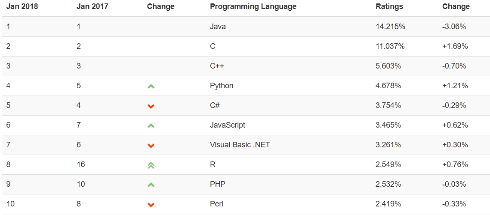

# Python简介
python的创始人为吉多·范罗苏姆（Guido van Rossum）。1989年的圣诞节期间，吉多·范罗苏姆为了在阿姆斯特丹打发时间，决心开发一个新的脚本解释程序，作为ABC语言的一种继承。  

最新的TIOBE排行榜，Python赶超C#占据第四！未来Python和Go是大势所趋，自己要好好加油了！
[TIOBE链接](https://www.tiobe.com/tiobe-index/)



# 编程语言的分类
## 编译型
- 优点：编译器一般会有预编译的过程对代码进行优化。因为编译只做一次，运行时不需要编译，所以编译型语言的程序执行效率高。可以脱离语言环境独立运行。
- 缺点：编译之后如果需要修改就需要整个模块重新编译。编译的时候根据对应的运行环境生成机器码，不同的操作系统之间移植就会有问题，需要根据运行的操作系统环境编译不同的可执行文件。
## 解释型
- 优点：有良好的平台兼容性，在任何环境中都可以运行，前提是安装了解释器（虚拟机）。灵活，修改代码的时候直接修改就可以，可以快速部署，不用停机维护。
- 缺点：每次运行的时候都要解释一遍，性能上不如编译型语言。

## 静态类型语言
静态语言是在编译时变量的数据类型可确定，多数静态类型语言要求在使用变量之前必须声明数据类型。  
例如：C++、Java、C#等。
## 动态类型语言
动态语言是在运行时变量的数据类型可确定。变量使用之前不需要类型声明，通常变量的类型是被赋值的那个值的类型。  
例如PHP/ASP/Ruby/Python/Perl/JavaScript等
```
静态语言：
public int add(int a,int b){
return a+b;
}

动态语言：
def add(a,b):
    return a+b
print(add(1,3))
```

## 强类型定义语言
一旦一个变量被指定了某个数据类型，如果不经过强制转换，那么它就永远是这个数据类型了。
## 弱类型定义语言
它与强类型定义语言相反, 一个变量可以赋不同数据类型的值。
```
强类型：
>>> "1"+2
Traceback (most recent call last):
  File "<stdin>", line 1, in <module>
TypeError: cannot concatenate 'str' and 'int' objects

弱类型：
>>> "1"+2
'12'
```
强类型定义语言在速度上可能略逊色于弱类型定义语言，但是强类型定义语言带来的严谨性能够有效的避免许多错误。另外，“这门语言是不是动态语言”与“这门语言是否类型安全”之间是完全没有联系的！

例如：Python是动态语言，是强类型定义语言（类型安全的语言）; VBScript是动态语言，是弱类型定义语言（类型不安全的语言）; JAVA是静态语言，是强类型定义语言（类型安全的语言）。

> 通过上面这些介绍，我们可以得出，python是一门动态解释性的强类型定义语言。
# 语法要求
**缩进统一**  
同一级别的代码必须一致！(并且建议所有级别的代码的缩进建议是相同的--必须，开发规范里建议4个空格）建议不要用table因为如果想把代码在windows上运行，linux和windows的table的定义不同！！！！好的编辑器能提高开发代码的效率！

# Python解释器
当我们编写Python代码时，我们得到的是一个包含Python代码的以.py为扩展名的文本文件。要运行代码，就需要Python解释器去执行.py文件。

由于整个Python语言从规范到解释器都是开源的，所以理论上，只要水平够高，任何人都可以编写Python解释器来执行Python代码（当然难度很大）。事实上，确实存在多种Python解释器。

CPython

当我们从Python官方网站下载并安装好Python 2.7后，我们就直接获得了一个官方版本的解释器：CPython。这个解释器是用C语言开发的，所以叫CPython。在命令行下运行python就是启动CPython解释器。

CPython是使用最广的Python解释器。教程的所有代码也都在CPython下执行。

IPython

IPython是基于CPython之上的一个交互式解释器，也就是说，IPython只是在交互方式上有所增强，但是执行Python代码的功能和CPython是完全一样的。好比很多国产浏览器虽然外观不同，但内核其实都是调用了IE。

CPython用>>>作为提示符，而IPython用In [序号]:作为提示符。

PyPy

PyPy是另一个Python解释器，它的目标是执行速度。PyPy采用JIT技术，对Python代码进行动态编译（注意不是解释），所以可以显著提高Python代码的执行速度。

绝大部分Python代码都可以在PyPy下运行，但是PyPy和CPython有一些是不同的，这就导致相同的Python代码在两种解释器下执行可能会有不同的结果。如果你的代码要放到PyPy下执行，就需要了解PyPy和CPython的不同点。

Jython

Jython是运行在Java平台上的Python解释器，可以直接把Python代码编译成Java字节码执行。

IronPython

IronPython和Jython类似，只不过IronPython是运行在微软.Net平台上的Python解释器，可以直接把Python代码编译成.Net的字节码。

> Python的解释器很多，但使用最广泛的还是CPython。如果要和Java或.Net平台交互，最好的办法不是用Jython或IronPython，而是通过网络调用来交互，确保各程序之间的独立性。

# Pyc
我们先来说两个概念，PyCodeObject和pyc文件。

我们在硬盘上看到的pyc自然不必多说，而其实PyCodeObject则是Python编译器真正编译成的结果。我们先简单知道就可以了，继续向下看。

当python程序运行时，编译的结果则是保存在位于内存中的PyCodeObject中，当Python程序运行结束时，Python解释器则将PyCodeObject写回到pyc文件中。

当python程序第二次运行时，首先程序会在硬盘中寻找pyc文件，如果找到，则直接载入，否则就重复上面的过程。

所以我们应该这样来定位PyCodeObject和pyc文件，我们说pyc文件其实是PyCodeObject的一种持久化保存方式。如果源码有更新python会比对pyc文件的时间戳，源码时间新则重新编译,否则直接执行pyc文件，以提高执行速度。
# 变量
## 声明变量
```
#!/usr/bin/env python
# -*- coding: utf-8 -*-
# Author: Li Sen
name ="Li Sen"
```
> 上述代码声明了一个变量，变量名为： name，变量name的值为字符串："Li Sen"
## 变量定义的规则：
1. 变量名只能是 字母、数字或下划线的任意组合
2. 变量名的第一个字符不能是数字
3. 以下关键字不能声明为变量名：
['and', 'as', 'assert', 'break', 'class', 'continue', 'def', 'del', 'elif', 'else', 'except', 'exec', 'finally', 'for', 'from', 'global', 'if', 'import', 'in', 'is', 'lambda', 'not', 'or', 'pass', 'print', 'raise', 'return', 'try', 'while', 'with', 'yield']
4. 变量名尽量友好,通俗易懂  
用户名：username="lisen"
5. 标识符名称是对大小写敏感的。  
例如，myname和myName不是一个标识符

- 变量赋值

```
#!/usr/bin/env python
# -*- coding: utf-8 -*-
# Author: Li Sen
name = "Alex Li"
 
name2 = name
print(name,name2)
 
name = "Jack"
 
print("What is the value of name2 now?")
```
> name2=name 表示name2存的是name的值的内存地址，name2为Alex Li,一旦name修改了，就会重新开辟一款内存空间
> print(name,name2)中逗号表示参数分割，两个参数传给print
- 变量赋值风格  
gf_of_oldboy:下划线  
GFOfOldboy:驼峰式
# 注释
当行注释：# 被注释内容

多行注释：''''被注释内容'''  """被注释内容"""

# 字符编码
- ASCII（American Standard Code for Information Interchange，美国标准信息交换代码）是基于拉丁字母的一套电脑编码系统，主要用于显示现代英语和其他西欧语言，其最多只能用 8 位来表示（一个字节），即：2**8 = 256-1，所以，ASCII码最多只能表示 255 个符号。
显然ASCII码无法将世界上的各种文字和符号全部表示，所以，就需要新出一种可以代表所有字符和符号的编码，即：Unicode
 
- Unicode（统一码、万国码、单一码）是一种在计算机上使用的字符编码。Unicode 是为了解决传统的字符编码方案的局限而产生的，它为每种语言中的每个字符设定了统一并且唯一的二进制编码，规定虽有的字符和符号最少由 16 位来表示（2个字节），即：2 **16 = 65536，
注：此处说的的是最少2个字节，可能更多

- UTF-8，是对Unicode编码的压缩和优化，他不再使用最少使用2个字节，而是将所有的字符和符号进行分类：ascii码中的内容用1个字节保存、欧洲的字符用2个字节保存，东亚的字符用3个字节保存...
- gbk，是中国标准，是指中国的中文字符，其它它包含了简体中文与繁体中文字符，另外还有一种字符“gb2312”，这种字符仅能存储简体中文字符，占2字节  

所以，python 2.x解释器在加载 .py 文件中的代码时，会对内容进行编码（默认ascill），如果是如下代码的话：
报错：ascii码无法表示中文
```
#!/usr/bin/env python
# Author: Li Sen
print("你好，世界")

改正：应该显示的告诉python解释器，用什么编码来执行源代码，即：
#!/usr/bin/env python
# -*- coding: utf-8 -*-
# Author: Li Sen
  
print("你好，世界")
```
> python 3.x 默认字符集为utf8，可以不用指定字符集
# 基本语法
## input输入
```
#!/usr/bin/env python
# -*- coding: utf-8 -*-
# Author: Li Sen
  
# 将用户输入的内容赋值给 name 变量
name = input("请输入用户名：")
  
# 打印输入的内容
print(name)
```

## if条件语句
```
#!/usr/bin/env python
# -*- coding: utf-8 -*-
# Author: Li Sen

import getpass
_username = 'lisen'
_password = '123'

username = input("username:")
#password = getpass.getpass("password:") #隐藏密码
password = input("password:")
if username == _username and password == _password:
    print("Welcome user {name} login...".format(name=username))
else:
    print("Invalid username or password!")

#!/usr/bin/env python
# -*- coding: utf-8 -*-
# Author: Li Sen
'''
lisen SVIP
wangwu VIP
zhangsan Diaosi
'''
name =  input("请输入用户名：")
if name == "lisen":
    print("SVIP")
elif name == "wangwu":
    print("VIP")
elif name == "zhangsan":
    print("Diaosi")
else:
    print("no such user!")
```

## while循环语句
```
#!/usr/bin/env python
# -*- coding: utf-8 -*-
# Author: Li Sen

age_of_oldboy = 56
count = 0
while count < 3:
    guess_age = int(input("guess age:"))
    if guess_age == age_of_oldboy:
        print("yes,you got it.")
        break
    elif guess_age > age_of_oldboy:
        print("think smaller....")
    else:
        print("think bigger!")
    count +=1
else:
    print("you have tried to many times!")
 ```

## for循环语句
```
#!/usr/bin/env python
# -*- coding: utf-8 -*-
# Author: Li Sen
age_of_oldboy=56
for i in range(3):
    guess_age = int(input("guess age:"))
    if guess_age==age_of_oldboy:
        print("yes,you got it.")
        break
    elif guess_age>age_of_oldboy:
        print("think smaller....")
    else:
        print("think bigger...")
else:
    print("you have tried too many times...")
```
## 死循环
```
#!/usr/bin/env python
# -*- coding: utf-8 -*-
# Author: Li Sen
while True:
    print("OK")
```

## break/continue
```
#!/usr/bin/env python
# -*- coding: utf-8 -*-
# Author: Li Sen
count=0
while count < 10:
    if count == 7:
        count += 1
        continue #运行到此，终止当前循环，开始下一轮循环
    print(count)
    count += 1
    
#!/usr/bin/env python
# -*- coding: utf-8 -*-
# Author:San Mu
count=0
max_count=3
username="lisen"
password="123"
while count < max_count:
    user=input("请输入用户名：")
    pwd=input("请输入密码：")
    if user == username and pwd == password:
        print("登陆成功！")
        break #运行到此，结束所有循环
    else:
        print("登陆失败！")
    count+=1
else:
    print("登陆次数过多！")
```
# 作业
1. 使用while循环输入 1 2 3 4 5 6     8 9 10
```
#!/usr/bin/env python
# -*- coding: utf-8 -*-
# Author: Li Sen
#方法1
'''
count=0
while count < 11:
    if count == 7:
        count += 1
        continue
    print(count)
    count += 1
'''
#方法2
count=0
while count < 11:
    if count==7:
        pass
        #count+=1
    else:
        print(count)
    count+=1
```

2. 求1-100的所有数的和
```
#!/usr/bin/env python
# -*- coding: utf-8 -*-
# Author: Li Sen
count=1
sum=0
while count < 101:
    sum+=count
    count+=1
print(sum)
```

3. 输出 1-100 内的所有奇数
```
#!/usr/bin/env python
# -*- coding: utf-8 -*-
# Author: Li Sen
count=1
while count < 101:
    if count % 2 != 0:
       print(count)
    count+=1
```

4. 输出 1-100 内的所有偶数
```
#!/usr/bin/env python
# -*- coding: utf-8 -*-
# Author: Li Sen
'''
count=1
while count < 101:
    if count % 2 == 0:
        print(count)
    count+=1
'''
n=1
while n < 101:
    temp=n % 2
    if temp != 0:
        pass
    else:
        print(n)
    n=n + 1
```

5. 求1-2+3-4+5 ... 99的所有数的和
```
#!/usr/bin/env python
# -*- coding: utf-8 -*-
# Author: Li Sen
count=1
sum=0
while count < 100:
   if count % 2 == 0:
       sum-=count
   else:
       sum+=count
   count+=1
print(sum)
```

6. 用户登陆（三次机会重试）
```
#!/usr/bin/env python
# -*- coding: utf-8 -*-
# Author: Li Sen
count=0
max_count=3
username="lisen"
password="123"
while count < max_count:
    user=input("请输入用户名：")
    pwd=input("请输入密码：")
    if user == username and pwd == password:
        print("登陆成功！")
        #exit()
        break
    else:
        print("登陆失败！")
    count+=1
else:
    print("登陆次数过多！")
```
