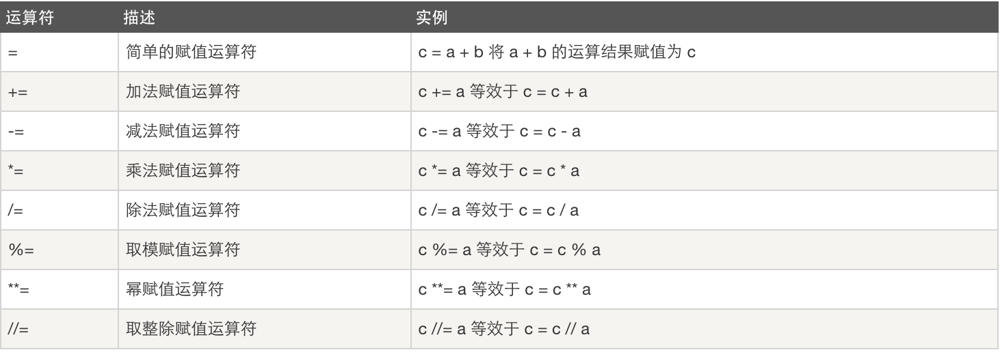

# 运算符
可以将运算符以运算结果类型进行分类：
- 结果类型为数值：算数运算、赋值运算
- 结果类型为布尔值：比较运算、逻辑运算、成员运算
## 算数运算
a = 10 * 10

## 赋值运算
a = a + 1  
a+=1

## 比较运算
a = 1 > 5

## 逻辑运算
a = 1>6 or 1==1

如果有多个表达式做逻辑运算，执行顺序：
1. 先计算括号内的
2. 没有括号按顺序从前到后执行：  
如果结果为True 后面是or True  
如果结果为True 后面是and 就继续往后判断  
如果结果为False 后面是or 就继续往后判断  
如果结果为False 后面是and 就为False  
## 成员运算
a = "文" in "郑建文"


# 基本数据类型
## 数字
### int(整型)
在32位机器上，整数的位数为32位，取值范围为-2**31～2**31-1，即-2147483648～2147483647  
在64位系统上，整数的位数为64位，取值范围为-2**63～2**63-1，即-9223372036854775808～9223372036854775807
对于int类型，常用方法如下：
```
#!/usr/bin/env python
# -*- coding: utf-8 -*-
# Author: Li Sen

#将字符串转换为数值
a = "123"
print(type(a),a)
b = int(a)
print(type(b),b)

#将字符串100以二进制的方式转成整数，base=2 代表二进制
num = "100"
v =  int(num, base=2)
print(v)

#整数5在二进制中可以用最少3位来表示
age = 5
# 1 1
# 2 10
# 3 11
# 4 100
# 5 101
r = age.bit_length()
print(r)
```
## 字符串
### 基本方法
```
#获取字符串中的某个或某些字符
s23 = "lisen"
# v23 = s23[2] 索引下标
# v23 = s23[0:2] #>=0 <2 切片
v23 = s23[0:-2] #>=0 <倒数2 切片
print(v23)

#获取字符串、列表等对象的长度,注意python3跟2的差别
s24 = "李森"
v24 = len(s24)
print(v24)
#输出为：2
#在python2中结果为6，utf-8中一个汉字占3个字节
s244 = [11,22,33,"abc"] #列表
v244 = len(s244)
print(v244)
#输出为：4

#使用for..in遍历
s25 = "李森你很帅"
for i in s25:
    print(i)
#输出为：
# 李
# 森
# 你
# 很
# 帅

#使用range，将文字和索引打印出来
s26 = input("请输入：")
l26 = len(s26)
for i in range(0,l26):
    print(i,s26[i])
#输出为：
# 请输入：qwe4
# 0 q
# 1 w
# 2 e
# 3 4
```
> 字符串一旦创建，就不可修改，一旦修改或拼接，都会重新在内存中生成字符串
### 一般方法
```
#!/usr/bin/env python
# -*- coding: utf-8 -*-
# Author: Li Sen

#首字母大写
s1 = "abc"
v1 = s1.capitalize()
print(v1)

#将字符串全部变大小写并进行判断是否全部为大写或小写
s2 = "ABC"
v2 = s2.casefold()
#所有字符串都变小写，casefold比lower更强大，能将其他未知的对应关系变小写，譬如法语，德语
v22 = s2.lower() #将所有字符串变小写
v222 = s2.islower() #判断字符串是否都是小写
v2222 = s2.upper() #将所有字符串变大写
v22222 = s2.isupper() #判断字符串是否都是大写
print(v2,v22,v222,v2222,v22222)

#设置字符串长度，并将内容居中,左对齐，右对齐
#20 字符串总长度
#默认空白填充，这里为“中”
s3 = "aaa"
#v3 = s3.center(20,"中")
#v3 = s3.ljust(20,"中")
v3 = s3.rjust(20,"中")
#v3 = s3.zfill(20) 填充符只能是0，右对齐
print(v3)

#统计字符串中，子序列的出现次数
#也可以指定开始位置和结束位置
s4 = "ababcdcd"
#v4 = s4.count("ab")
v4 = s4.count("ab",1,4)
print(v4)

#判断字符串是不是以什么子序列开始或结束，返回True或False
s5 = "abcd"
#v5 = s5.endswith("cd")
v5 = s5.startswith("ab")
print(v5)

#查找字符串中，得到子序列第一次出现的位置
#计算机统计都是从0开始计算而非1
#index作用一样，但如果找不到会报错不建议用，find不会报错，找不到返回-1
s6 = "abcefg"
#v6 = s6.index("ef")
v6 = s6.find("ef")
print(v6)

#格式化输出，将一个字符串中的占位符替换为指定的值
#百分号方式这里不示例说明
s7 = "I am {name}, age is {age}"
v7 = s7.format(name="lisen",age=18)
print(v7)

s7_1 = "I am {0}, age is {1}"
v7_1 = s7_1.format("lisen1",20)
print(v7_1)

s7_2 = "I am {name}, age is {age}"
v7_2 = s7_2.format_map({"name":"lisen2","age":22})
print(v7_2)

#判断字符串中是否只包含字母和数字,结果为布尔值
s8 = "abc123"
v8 = s8.isalnum()
print(v8)

#从头到尾，以10个字符一组比对，碰到tab将tab补足10位
s9 = "username\temail\tpassword\nlisen\t123@123.com\t123\nzhangsan\t123@123.com\t123"
v9 = s9.expandtabs(10)
print(v9)
# 输出为
# username  email     password
# lisen     123@123.com         123
# zhangsan  123@123.com         123

#判断字符串是否都是字母或汉字，结果为布尔值
#s10 = "abc"
s10 = "中国"
v10 = s10.isalpha()
print(v10)

#判断字符串是否都是数字，结果为布尔值,对于特殊的数字例如②isdecimal识别不了,它支持识别十进制数字，但isdigit可以识别,如果是中文的“二”（字节类型），则只有isnumeric能识别
#s11 = "2"
# s11 = "②"
s11 = "二"
v11 = s11.isdecimal()
v111 = s11.isdigit()
v1111 =  s11.isnumeric()
print(v11,v111,v1111)

#判断字符串中是否包含不可显示的字符如：\t \n,结果为布尔值，有则为False
s12 = "afsfa\tadfa"
v12 = s12.isprintable()
print(v12)
# 输出为False

#判断字符串是否全部为空格,结果为布尔值
s13 = "aa  ii"
v13 = s13.isspace()
print(v13)
# 输出为False

#大小写互换
s14 = "Lisen Verry Nice"
v14 = s14.swapcase()
print(v14)

#是否是标识符：由字母、数字、下划线组成，且不能以数字开头，结果为布尔值
s15 = "def"
v15 = s15.isidentifier()
print(v15)

#判断字符串是否是标题：首字母大写
s16 = "Lisen Is A Good Men"
v16 = s16.istitle()
print(v16)

#将字符串中的每一个元素按照指定的分隔符进行拼接
s17 = "你是风儿我是沙"
# t = "_"
# v17 = t.join(s17)
v17 = "_".join(s17)
print(v17)

#去除字符串中指定字符,默认为不显示的字符如：空格 \t \n,按对应顺序进行最大匹配，没匹配上则立即停止
s18 = "abcdefg"
v18 = s18.lstrip("abfg") #从左开始
v188 = s18.rstrip("abfg") #从右开始
v1888 = s18.strip("abfg") #从两边开始
print(v18,v188,v1888)
#输出：cdefg abcde cde

#将字符串s19中的afk替换为对应123
s19 = "abcdefghijk"
m19 = str.maketrans("afk", "123")
v19 = s19.translate(m19)
print(v19)
#输出为：1bcde2ghij3
s199 = "aaaccbbccddcc"
v199 = s199.replace("cc","66",2) #将字符串中前2个cc替换为66
print(v199)
#输出为：aaa66bb66ddcc

#将字符串按照指定字符分割成3份
s20 = "aaasbbbscccseee"
v20 = s20.partition("s") #从左开始
v200 = s20.rpartition("s") #从右开始
print(v20,v200)
#输出为：('aaa', 's', 'bbbscccseee') ('aaasbbbsccc', 's', 'eee')

#将字符串按照指定字符进行分割，分割次数可以指定，默认为全部分割
#分割符将会被去除
s21 = "aaasbbbscccseee"
# v21 = s21.split("s")
v21 = s21.split("s",1)
v211 = s21.rsplit("s",1) #从右开始
print(v21,v211)
#输出为：['aaa', 'bbbscccseee'] ['aaasbbbsccc', 'eee']

#将字符串进行分割，不过分隔符只能是\n，True/False表示是否保留\n,默认为False
s22 = "aaa\nbbb\nccc"
v22 = s22.splitlines(True)
print(v22)
#输出为：['aaa\n', 'bbb\n', 'ccc']
```

# 作业
1. 执行Python脚本的方式	
   - /path/to/python filename  
   - 配置环境变量python  交互式
   - 脚本添加#!/usr/bin/env python 并赋执行权限 ./filename
2. 简述位、字节的关系  
   1Byte=8bit
3. 简述 ascii、unicode、utf-8、gbk 的关系
   - ascii是美国美国标准只能表示常规的英文字符，占1个字节
   - unicode的是国际标准，能表示世界绝大数国家语言字符，占最少2个字节
   - utf-8是unicode的优化压缩版本，占用空间更小，如果是ascii就1个字节，如果是欧洲字符就2个字节，中文为3个字节
   - gbk，是中国标准，是指中国的中文字符，其它它包含了简体中文与繁体中文字符，另外还有一种字符“gb2312”，这种字符仅能存储简体中文字符，占2字节
4. 请写出“李杰”分别用utf-8和gbk编码所占的位数
   李杰：utf-8:6byte gbk:4byte
   ```
   n ="李杰"
   #python3 以字符输出，输出为2个字符
   for i in n:
       print(i)
   #python2 以字节输出，输出为6个字节
   for i in n:
       print(i)
   ```
5. Pyhton单行注释和多行注释分别用什么？
   - 单行注释#  
   - 多行注释"""" """/''' '''
6. 声明变量注意事项有那些？
   - 变量有字母、数字、下划线组成且不能以数字开头
   - python自带关键字不能用作变量名，比如：if else and while for ...
7. 如有一下变量n1=5，请使用int的提供的方法，得到该变量最少可以用多少个二进制位表示？	
   ```
   n1 = 5
   m1 = n1.bit_length()
   print(m1)
   
   a = "123"
   b = int(a)
   
   a1 = 123
   b1 = str(a1)
   b2 = bool(a1)
   ```
   
8. 布尔值分别有什么？  
   True False  
   ""--->False  
   " "--->True
   0--->True  
   其他数值--->False  
9. 阅读代码，请写出执行结果
   ```
   a="alex"
   b=a.capitalize()
   print(a)
   print(b)
   请写出输出结果：
   ```
   alex Alex
10. 写代码，有如下变量，请按照要求实现每个功能
    ```
    name="aleX"
    10.1判断name变量对应的值是否以"al"开头，并输出结果
    10.2判断name变量对应的值是否以"X"结尾，并输出结果
    10.3将name变量对应的值中的“l”替换为“p”，并输出结果
    10.4将name变量对应的值根据“l”分割，并输出结果。
    10.5将name变量对应的值变大写，并输出结果
    10.6将name变量对应的值变小写，并输出结果
    10.7请输出name变量对应的值的第2个字符？
    10.8请输出name变量对应的值的前3个字符？
    10.9请输出name变量对应的值的后2个字符？
    10.10请输出name变量对应的值中“e”所在索引位置？
    10.11获取子序列，仅不包含最后一个字符。如：oldboy则获取oldbo;root则获取roo
    
    #!/usr/bin/env python
    # -*- coding: utf-8 -*-
    # Author: Li Sen
    
    name = "aleX"
    v1 = name.startswith("al")
    v2 = name.endswith("X")
    v3 = name.replace("l","p")
    v4 = name.partition("l")
    v5 = name.upper()
    v6 = name.lower()
    v7 = name[1]
    v8 = name[0:3]
    v9 = name[-2:]
    v10 =name.find("e")
    v11 = name[0:-1]
    print(v1,v2,v3,v4,v5,v6,v7,v8,v9,v10,v11)
    ```
11. 字符串是否可迭代对象？如可以请使用for 循环每一个元素？  字符串是可迭代的对象
    ```
    for i in "abcdef":
        print(i)
    ```
12. 请用代码实现：
    - 利用下划线将列表的每一个元素拼接成字符串，li="alexericrain"
    - 利用下划线将列表的每一个元素拼接成字符串，li=['alex','eric','rain']join  
    ```
    li = "alexericrain"
    v13 = "_".join(li)
    print(v13)
    li1 = ["aa","bb","cc"]
    v14 = "_".join(li1)
    print(v14)
    ```
13. Python2中的range和Python3中的range的区别？    
python2中range执行时会将所有数的内存空间创建，而python3 range在循环时依次创建内存空间  
python2 xrang == python3 range
    ```
    for i in range(0,100,1)
        print(i)
    for i in range(100,1,-1)
        print(i)
    ```
14. 实现一个整数加法计算器：
如：
content=input('请输入内容：')如：5+9
    ```
    #法1：
    s14 = input("请输入数：")
    v1,v2 = s14.split("+")
    v1 = int(v1)
    v2 = int(v2)
    sum = v1 + v2
    print(sum)
    #法2：
    sum = 0
    s15 = input("请输入内容：")
    v15 = s15.split("+")
    print(v15)
    for i in v15:
        i = int(i)
        sum += i
    print(sum)
    ```
15. 计算用户输入的内容中有几个十进制小数？几个字母？
如：content=input('请输入内容：')如：asduiaf878123
    ```
    sum1 = 0
    sum2 = 0
    s16 = input("请输入内容：")
    for i in s16:
        if i.isalpha():
            sum1 +=1
        elif i.isdecimal():
            sum2 +=1
    print("alpha:{sum1}\ndecimal:{sum2}".format(sum1=sum1,sum2=sum2))
    
    ```
16. 制作趣味模板程序,需求：等待用户输入名字、地点、爱好，根据用户的名字和爱好进行任意现实
如：敬爱可亲的xxx，最喜欢在xxx 地方,进行xxx
    ```
    name = input("请输入姓名：")
    address = input("请输入地点：")
    fa = input("请输入爱好:")
    print("敬爱可亲的{name}，最喜欢在{address}进行{fa}".format(name=name,address=address,fa=fa))
    ```
17. 制作随机验证码，不区分大小写。
流程：  
用户执行程序  
给用户显示需要输入的验证码  
用户输入的值  
用户输入的值和显示的值相同时现实正确信息；否则继续生成随机验证码继续等待用户输入
    ```
    def check_code():
        import random
        checkcode = ""
        for i in range(4):
            current = random.randrange(0,4)
            if current != i:
                temp = chr(random.randint(65,90))
            else:
                temp =  random.randint(0,9)
            checkcode += str(temp)
        return checkcode
    code = check_code()
    code1 = code.lower()
    print(code)
    while True:
        code2 = input("请输入验证码：")
        code3 = code2.lower()
        if code3 == code1:
            print("验证码正确")
            break
        else:
            print("验证码错误")
    ```
18. 开发敏感词语过滤程序，提示用户输入内容，如果用户输入的内容中包含特殊的字符：如"苍老师""东京热"，则将内容替换为***
    ```
    a = "苍老师"
    b = "东京热"
    c = input("请输入内容:")
    c = c.replace(a,"***")
    c = c.replace(b,"***")
    print(c)
    ```
19. 制作表格
循环提示用户输入：用户名、密码、邮箱（要求用户输入的长度不超过20 个字符，如果超过则只有前20 个字符有效）如果用户输入q 或Q表示不再继续输入，将用户输入的内容以表格形式大隐
    ```
    while True:
       name1 = input("请输入用户名：")
       name2 = name1.lower()
       if name2 == "q":
           break
       password1 = input("请输入密码：")
       password2 = password1.lower()
       if password2 == "q":
           break
       email1 = input("请邮箱：")
       email2 = email1.lower()
       if email2 == "q":
           break
       name1 = name1[0:21]
       password1 = password1[0:21]
       email1 = email1[0:21]
       ss ="{name}\t{password}\t{email}\n".format(name=name1,password=password1,email=email1)
       print(ss)
    ss += ss
    vv = ss.expandtabs(20)
    print(vv)
    ```
