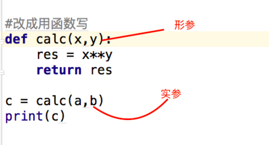

# 数据类型总结
- 按存值个数区分  
标量／原子类型：数字，字符串  
容器类型：列表，元组，字典
 
- 按可变不可变区分  
可变类型是不可hash类型/不可变类型是可hash类型   
可变：列表，字典  
不可变：数字，字符串，元组

- 按访问顺序区分  
直接访问：数字  
顺序访问（序列类型）：字符串，列表，元组  
key值访问（映射类型）：字典

# 集合
python中集合概念就是大家初高中学的集合，可以求交集、并集等，理解没什么难点就是要熟悉python相关语法
## 定义集合:
set是一个无序而且不重复的集合
```
集合：可以包含多个元素，用逗号分割，
示例：
s1={1,2,3}  
s2=set([2,5,6]) #用set定义一个集合(参数为一个列表)
集合的元素遵循三个原则：
1.每个元素必须是不可变类型(可hash，可作为字典的key)
2.没有重复的元素
3.无序
```
## 基本方法
```
#!/usr/bin/env python
# -*- coding: utf-8 -*-
# Author: Li Sen

# s1 = {1,2,3,1}
# print(s1) # 自动去重
#输出为：{1, 2, 3}

# s2 = set([2,3,4,5])
# print(s2) # 使用set+列表生成集合
#
# s1.add(4) # 添加一个元素4
# print(s1)

# s1.clear() # 清空集合
# print(s1)

# s3 = s1.copy() # 拷贝集合（浅拷贝）
# print(s3)

# 返回一个s1中存在，而s2不存在的值给s3，s1并没有改变
# s3 = s1.difference(s2)
# print(s3)

# s1.difference_update(s2) # 从s1中删除和s2相同的元素
# print(s1)

# s1.discard(1) # 删除一个元素，不存在不报错
# s1.remove(1) # 删除一个元素，不存在报错
# a = s1.pop() # 删除一个元素,并将删除的元素赋值给a，集合是无序的，所以删除也是随机的
# s1.update([11,22]) # 更新或添加元素，这里元素是列表形式
# print(s1)

# r1 = s1.intersection(s2) # 交集
# print(r1)
# s1.intersection_update(s2) # 取交集并重新更新覆盖s1中
# print(s1)

# a = s1.issubset(s2) # 判断s1是否是s2的子集，是为True,否为False
# a = s1.issuperset(s2) # 判断s1是否是s2的父集
# a =  s2.isdisjoint(s1) # 判断s1和s2是否无交集，有为False,没有为True

# a = s1.union(s2) # 求并集并赋值给a
# a = s1.symmetric_difference(s2) #  对称差集：s1并s2 - s1交s2
# print(a)
# s1.symmetric_difference_update(s2) #对称差集并更新覆盖s1
# print(s1)

# 生成无序去重的列表
# names = ["lisen","lisen","zhangsan"]
# names = list(set(names))
# print(names)
```
## 不可变集合
set(可变集合)与frozenset(不可变集合)的区别：  
- set无序排序且不重复，是可变的，有add，remove等方法。既然是可变的，所以它不存在哈希值。基本功能包括关系测试和消除重复元素. 集合对象还支持union(并集), intersection(交集), difference(差集)和sysmmetric difference(对称差集)等数学运算. 
- sets 支持 x in set, len(set),和 for x in set。作为一个无序的集合，sets不记录元素位置或者插入点。因此，sets不支持 indexing, 或其它类序列的操作。
- frozenset，它是不可变的，存在哈希值，好处是它可以作为字典的key，也可以作为其它集合的元素。缺点是一旦创建便不能更改，没有add，remove方法。
```
#!/usr/bin/env python
# -*- coding: utf-8 -*-
# Author: Li Sen

# names ="lisen"
# names = frozenset(names)
# print(s)
# 输出为：frozenset({'l', 's', 'e', 'i', 'n'})

# names = ["lisen","lisen","zhangsan"]
# names = frozenset(names)
# print(names)
# 输出为：frozenset({'lisen', 'zhangsan'})
```

# 字符串格式化
Python的字符串格式化有两种方式: 百分号方式、format方式,百分号的方式相对来说比较老，而format方式则是比较先进的方式，企图替换古老的方式，目前两者并存
## 百分号
- 格式说明
```
%[(name)][flags][width].[precision]typecode

(name)      可选，用于选择指定的key
flags          可选，可供选择的值有:
+       右对齐；正数前加正好，负数前加负号；
-        左对齐；正数前无符号，负数前加负号；
空格    右对齐；正数前加空格，负数前加负号；
0        右对齐；正数前无符号，负数前加负号；用0填充空白处
width         可选，占有宽度
.precision   可选，小数点后保留的位数
typecode    必选
s，获取传入对象的__str__方法的返回值，并将其格式化到指定位置
r，获取传入对象的__repr__方法的返回值，并将其格式化到指定位置
c，整数：将数字转换成其unicode对应的值，10进制范围为 0 <= i <= 1114111（py27则只支持0-255）；字符：将字符添加到指定位置
o，将整数转换成 八  进制表示，并将其格式化到指定位置
x，将整数转换成十六进制表示，并将其格式化到指定位置
d，将整数、浮点数转换成 十 进制表示，并将其格式化到指定位置
e，将整数、浮点数转换成科学计数法，并将其格式化到指定位置（小写e）
E，将整数、浮点数转换成科学计数法，并将其格式化到指定位置（大写E）
f， 将整数、浮点数转换成浮点数表示，并将其格式化到指定位置（默认保留小数点后6位）
F，同上
g，自动调整将整数、浮点数转换成 浮点型或科学计数法表示（超过6位数用科学计数法），并将其格式化到指定位置（如果是科学计数则是e；）
G，自动调整将整数、浮点数转换成 浮点型或科学计数法表示（超过6位数用科学计数法），并将其格式化到指定位置（如果是科学计数则是E；）
%，当字符串中存在格式化标志时，需要用 %%表示一个百分号
注：Python中百分号格式化是不存在自动将整数转换成二进制表示的方式
```
- 基本用法
```
#!/usr/bin/env python
# -*- coding: utf-8 -*-
# Author: Li Sen

# %s可以接收任何数据类型,都当做字符串来处理，不过一般不建议都用%s，不规范
# msg='i am %s my hobby is %s' % ('lhf','alex')
# print(msg)
# msg='i am %s my hobby is %s' % ('lhf',1)
# msg='i am %s my hobby is %s' % ('lhf',[1,2])

#使用变量
# name='lhf'
# age=19
# msg='i am %s my hobby is %s' % (name,age)
# print(msg)
# 字符串截取
# msg = "i am %.3s" % ("zhangsan")
# print(msg)

# %d 整型数字
# a = "i am %s age %d" % ("alex", 18)
# print(a)

# 字典形式
# b = "i am %(name)s age %(age)d" % {"name": "alex", "age": 18}
# print(b)
#
# 打印浮点数
# 小数点后保留两位(会四舍五入),默认保留6位
# c = "percent %.2f" % 99.97623
# print(c)
# d = "i am %(pp).2f" % {"pp": 123.425556}
# print(d)
# 打印百分号
# e = "i am %.2f %%" % 123.425556
# print(e)

# 右对齐占20个位
# msg='i am %(name)+20s' %{'name':'lhf'}
# print(msg)

# 加颜色
# msg='i am \033[43;1m%(name)+20s\033[0m' %{'name':'lhf'}
# print(msg)
```
# format方式
- 格式说明
```
[[fill]align][sign][#][0][width][,][.precision][type]

fill           【可选】空白处填充的字符
align        【可选】对齐方式（需配合width使用）
<，内容左对齐
>，内容右对齐(默认)
＝，内容右对齐，将符号放置在填充字符的左侧，且只对数字类型有效。 即使：符号+填充物+数字
^，内容居中
sign         【可选】有无符号数字
+，正号加正，负号加负；
 -，正号不变，负号加负；
空格 ，正号空格，负号加负；
#            【可选】对于二进制、八进制、十六进制，如果加上#，会显示 0b/0o/0x，否则不显示
，            【可选】为数字添加分隔符，如：1,000,000
width       【可选】格式化位所占宽度
.precision 【可选】小数位保留精度
type         【可选】格式化类型
传入” 字符串类型 “的参数
s，格式化字符串类型数据
空白，未指定类型，则默认是None，同s
传入“ 整数类型 ”的参数
b，将10进制整数自动转换成2进制表示然后格式化
c，将10进制整数自动转换为其对应的unicode字符
d，十进制整数
o，将10进制整数自动转换成8进制表示然后格式化；
x，将10进制整数自动转换成16进制表示然后格式化（小写x）
X，将10进制整数自动转换成16进制表示然后格式化（大写X）
传入“ 浮点型或小数类型 ”的参数
e， 转换为科学计数法（小写e）表示，然后格式化；
E， 转换为科学计数法（大写E）表示，然后格式化;
f ， 转换为浮点型（默认小数点后保留6位）表示，然后格式化；
F， 转换为浮点型（默认小数点后保留6位）表示，然后格式化；
g， 自动在e和f中切换
G， 自动在E和F中切换
%，显示百分比（默认显示小数点后6位）
```
- 基本用法
```
#!/usr/bin/env python
# -*- coding: utf-8 -*-
# Author: Li Sen

# 元组方式，按顺序一一对应，不能少或多，会报错
# b = "i am {}, age {}, {}".format("seven", 18, 'alex')
# print(b)
# 元组方式，按索引位置
# b = "i am {0}, age {1}, really {0}".format("seven", 18)
# print(b)

# 列表方式，按循序
# b = "i am {}, age {},love {}".format(*["seven", 18, 'alex'])
# print(b)
# 列表方式，按索引位置
# b = "i am {0}, age {1}, really {0}".format(*["seven", 18])
# print(b)
# b = "i am {0[0]}, age {0[1]}, really {0[2]}".format([1, 2, 3], [11, 22, 33])

# 字典方式
# b = "i am {name}, age {age}, really {name}".format(name="seven", age=18)
# b = "i am {name}, age {age}, really {name}".format(**{"name": "seven", "age": 18})

# 约束数据类型
# b = "i am {:s}, age {:d}, money {:f}".format("seven", 18, 88888.1)
# b = "i am {:s}, age {:d}".format(*["seven", 18])
# b = "i am {name:s}, age {age:d}".format(name="seven", age=18)
# b = "i am {name:s}, age {age:d}".format(**{"name": "seven", "age": 18})
# print(b)

# 打印转换输出数据格式(十进制，十六进制等)
# b = "numbers: {:b},{:o},{:d},{:x},{:X}, {:%}".format(15, 15, 15, 15, 15, 15.87623, 2)
# b = "numbers: {:b},{:o},{:d},{:x},{:X}, {:%}".format(15, 15, 15, 15, 15, 15.87623, 2)
# b = "numbers: {0:b},{0:o},{0:d},{0:x},{0:X}, {0:%}".format(15)
# b = "numbers: {num:b},{num:o},{num:d},{num:x},{num:X}, {num:%}".format(num=15)
# print(b)
```
# 函数
函数一词来源于数学，但编程中的「函数」概念，与数学中的函数是有很大不同的，具体区别，我们后面会讲，编程中的函数在英文中也有很多不同的叫法。在BASIC中叫做subroutine(子过程或子程序)，在Pascal中叫做procedure(过程)和function，在C中只有function，在Java里面叫做method。
## 定义 
函数是指将一组语句的集合通过一个名字(函数名)封装起来，要想执行这个函数，只需调用其函数名即可
## 特性  
减少重复代码,代码可读性好  
使程序变的可扩展易维护  
## 语法
```
语法：
def 函数名(参数1,参数2,参数3,...):
    '''注释'''
    函数体
    return 返回的值
#函数名要能反映其意义
#()也可以没有参数

示例：
def sum(a,b):              #定义函数
    ret=a+b                #函数体
    return ret             #函数返回
a = sum(1,2)            #调用函数并打印出结果
print(a)
#如果没有return语句，函数执行完毕后也会返回结果，只是结果为None
```
## 函数参数
 - 形参  
   形参变量只有在被调用时才分配内存单元，在调用结束时，即刻释放所分配的内存单元。因此，形参只在函数内部有效。函数调用结束返回主调用函数后则不能再使用该形参变量

 - 实参  
   实参可以是常量、变量、表达式、函数等，无论实参是何种类型的量，在进行函数调用时，它们都必须有确定的值，以便把这些值传送给形参。因此应预先用赋值，输入等办法使参数获得确定值  
   
 - 位置参数
   ``` 
   def test(x, y, z): #形参实参必须一一对应，多与少都不行
       res = x + y + z
       return res
   
   a = test(1, 2, 3)
   print(a)
   ``` 
 - 关键字参数  
   正常情况下，给函数传参数要按顺序，不想按顺序就可以用关键参数，只需指定参数名即可，但记住一个要求就是，关键参数必须放在位置参数之后。
   ``` 
   def test(x, y, z):
       res = x + y + z
       return res
   
   a = test(x=1,z=3,y=2) #形参实参位置可以不固定
   a = test(1,z=3,y=2) # 没问题
   a = test(x=1,z=3,2) # 位置参数在关键参数前面报错
   
   print(a)
   ``` 
 - 默认参数
   ``` 
   # 需要放在参数列表最后
   def fun(name,age=19): #age=19是默认参数，如果不传的话默认为19
       print('%s:%d' %(name,age))
   fun("lisen")
   # 输出为：lisen:19 
   ``` 
 - 可变长参数  
 若你的函数在定义时不确定用户想传入多少个参数，就可以使用非固定参数
   ``` 
   # ===========*args===========
   # def foo(x,y,*args): # *args 会把多传入的参数变成一个元组形式
   #     print(x,y,args)
   # foo(1,2,3,4,5)
   # foo(1,2,*[3,4,5])
   # foo(*[1,2,3])
   # 输出为：
   # 1 2 (3, 4, 5)
   # 1 2 (3, 4, 5)
   # 1 2 (3,)
   
   # ==========**kwargs===========
   # def foo(x,y,**kwargs): # **kwargs会把多传入的参数变成一个字典形式
   #     print(x,y,kwargs)
   # foo(1,2,a=1,b=2,c=3)
   # foo(1,2,**{'a':1,'b':2,'c':3})
   # foo(**{'z':1,'x':2,'y':3})
   # 输出为：
   # 1 2 {'a': 1, 'b': 2, 'c': 3}
   # 1 2 {'a': 1, 'b': 2, 'c': 3}
   # 2 3 {'z': 1}
   
   # ========*args+**kwargs=========
   # def test(x,*args,**kwargs):
   #     print(x)
   #     print(args,args[-1])
   #     print(kwargs,kwargs.get('y'))
   # test(1,2,1,11,1,y=2,z=3)
   # 输出为：
   # 1
   # (2, 1, 11, 1) 1
   # {'y': 2, 'z': 3} 2
   
   # test(1,*[1,2,3],**{'y':1})
   # 输出为：
   # 1
   # (1, 2, 3) 3
   # {'y': 1} 1
   ``` 
# 作业
  1. 寻找差异
      ``` 
      #!/usr/bin/env python
      # -*- coding: utf-8 -*-
      # Author: Li Sen
      # 数据库中原有
      old_dict = {
          "#1":{ 'hostname':'c1', 'cpu_count': 2, 'mem_capicity': 80 },
          "#2":{ 'hostname':'c1', 'cpu_count': 2, 'mem_capicity': 80 },
          "#3":{ 'hostname':'c1', 'cpu_count': 2, 'mem_capicity': 80 }
      }
      # cmdb 新汇报的数据
      new_dict = {
          "#1":{ 'hostname':'c1', 'cpu_count': 2, 'mem_capicity': 800 },
          "#3":{ 'hostname':'c1', 'cpu_count': 2, 'mem_capicity': 80 },
          "#4":{ 'hostname':'c2', 'cpu_count': 2, 'mem_capicity': 80 }
      }
      # old_set = set(old_dict)
      # new_set = set(new_dict)
      # 
      # del_set = old_set.difference(new_set)
      # add_set = new_set.difference(old_set)
      # flush_set = old_set.intersection(new_set)
      # 
      # for i in del_set:
      #     old_dict.pop(i)
      # 
      # for i in add_set:
      #     old_dict[i] = new_dict[i]
      # 
      # for i in flush_set:
      #     old_dict[i] = new_dict[i]
      # print(old_dict) 
      ``` 
   2. 写函数，计算传入字符串中【数字】、【字母】、【空格] 以及 【其他】的个数　
      ``` 
      #!/usr/bin/env python
      # -*- coding: utf-8 -*-
      # Author: Li Sen
      # def check_str(a):
      #     res = {
      #         "num":0,
      #         "string":0,
      #         "space":0,
      #         "other":0
      #     }
      #     for i in a:
      #         if i.isdigit():
      #             res["num"]+=1
      #         elif i.isalpha():
      #             res["string"]+=1
      #         elif i.isspace():
      #             res["space"]+=1
      #         else:
      #             res["other"]+=1
      #     return res
      # b = check_str("abcd  123123 ::")
      # print(b)   
      ``` 
 4. 写函数，检查传入列表的长度，如果大于2，那么仅保留前两个长度的内容，并将新内容返回给调用者。   
      ``` 
      # def check_list(li):
      #     a = len(li) 
      #     if a > 2:
      #         b = li[0:2]
      #     return b
      # print(check_list(["a","b",1,2,3]))
      ``` 
 5. 写函数，检查获取传入列表或元组对象的所有奇数位索引对应的元素，并将其作为新列表返回给调用者。
     ``` 
     # def check_list(li):
     #     return li[::2]
     # print(check_list(["a","b",1,2,3]))
     ``` 
 
 6. 写函数，检查字典的每一个value的长度,如果大于2，那么仅保留前两个长度的内容，并将新内容返回给调用者。 ps:字典中的value只能是字符串或列表
      ``` 
      # dic = {"k1": "v1v1", "k2": [11,22,33,44]}
      # 
      # def check_dic(dic):
      #     d = {}
      #     for k,v in dic.items():
      #         if len(v) > 2:
      #             d[k] = v[0:2]
      #     return d
      # print(check_dic(dic))
      ``` 
 
