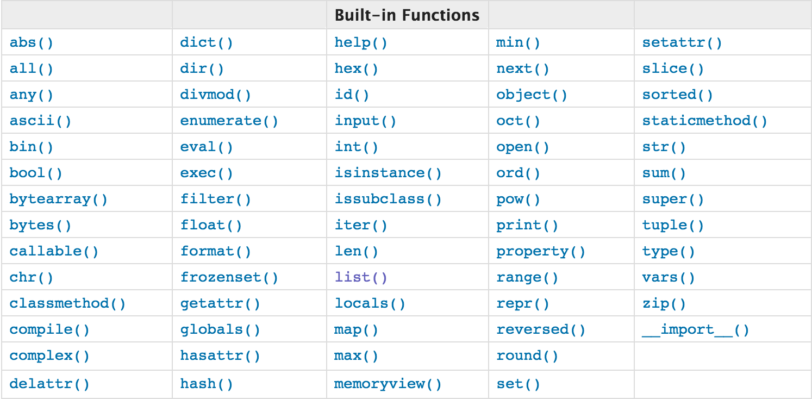

# 匿名函数
```
lambda  arguments:express    
#arguments 参数(可以有多个参数)
#express 表达式
#lambda返回值是一个函数的地址，也就是函数对象
aa = lambda  arguments:express  #把的到lambda函数地址，赋值给变量aa
```
- 匿名函数就是不需要显式的指定函数
```
# 示例
# 一般函数
def calc(n):
    return n ** n
print(calc(10))

# 换成匿名函数
calc = lambda n: n ** n
print(calc(10))
```
- 匿名函数一般不单独使用，常与其他函数配合使用
```

dic={'k1':10,'k2':100,'k3':30}

print(max(dic))
print(max(dic,key=lambda k:dic[k]))
print(dic[max(dic,key=lambda k:dic[k])])
# 输出为：
# k3
# k2
# 100
```
> - lambda函数可以参数可以有多个，包含的表达式不能超过一个，不要试图向lambda函数中塞入太多东西，如果你需要做复杂的功能，应该定义一个普通函数。
> - lambda函数用在需要封装特殊的，非重用代码上，避免令我们的代码充斥大量的单行函数。
# 函数式编程
- 面向过程编程：我们通过把大段代码拆成函数，通过一层一层的函数，可以把复杂的任务分解成简单的任务，这种一步一步的分解可以称之为面向过程的程序设计。函数就是面向过程的程序设计的基本单元。
```
找到问题的入口，然后按流程一步步解决,例如某人结婚：
1. 搜索目标
2. 表白：表白成功进入2，失败进入1
3. 恋爱：恋爱成功进入4，失败进入1
4. 见家长：见家长成功进入5，失败进入1
5. 结婚
```
- 函数式编程：是使用一系列函数去解决问题，函数式编程就是根据编程的范式来的出想要的结果，只要是输入时确定的，输出就是确定的。
> 函数式编程中的函数这个术语不是指计算机中的函数（实际上是Subroutine），而是指数学中的函数，即自变量的映射。也就是说一个函数的值仅决定于函数参数的值，不依赖其他状态。比如sqrt(x)函数计算x的平方根，只要x不变，不论什么时候调用，调用几次，值都是不变的。
```
函数式=编程语言定义的函数+数学意义的函数
y = 2*x+1
# 传统面对过程：一步步分解
def cal(x):
    res = 2 * x
    res += 1
    return res
# 函数式：
def cal(x):
    return 2*x +1
```
简单说，"函数式编程"是一种"编程范式"（programming paradigm），也就是如何编写程序的方法论。
主要思想是把运算过程尽量写成一系列嵌套的函数调用。

# 高阶函数
- 函数的传入参数是一个函数名
```
# 把函数当做参数传给高阶函数
import time
def foo():
    time.sleep(3)
    print('from the foo')

def timmer(func):
    start_time=time.time()
    func()
    stop_time=time.time()
    print('函数%s 运行时间是%s' %(func,stop_time-start_time))
timmer(foo)
```
- 函数的返回值是一个函数名
```
import time
def timer(func):
    def wrapper(name,age): # 添加参数
        start_time = time.time()
        aa = func(name,age) # 添加参数
        stop_time = time.time()
        print("函数的运行时间为 %s" %(stop_time - start_time))
        return aa
    return wrapper

def foo(name,age):
    time.sleep(3)
    print("hello world! 我是%s,年龄为%d" %(name,age))
    return "foo"
foo = timer(foo) # 这是wrapper的内存地址
foo("lisen",20) # 相当于wrapper("lisen",20)
```
## map函数
map(func,iterable):  
map()函数接受两个参数，一个是函数，一个可迭代的对象(iterable),map将传入的函数依次作用到序列的每个元素，并把结果作为新的可迭代的对象的结果返回
```
# 让列表n每个元素都加1
n = [1,2,3,4,5]
res= []
for i in n:
    i += 1
    res.append(i)
print(res)

# 如果我们有一万个列表或者让每个元素平方，那么你只能把上面的逻辑定义成函数传参完成
# 用一般函数完成
def add_n(x):
    return x+1
def map_add(func,array):
    res = []
    for i in n:
        i = func(i)
        res.append(i)
    return res
print(map_add(add_n,n))
# 匿名函数方式
print(map_add(lambda x:x+1,n))

# 最终版：用map函数完成
m = map(lambda x:x+1,n)
print(list(m)) # map得到的结果是可迭代对象,需要用list函数让它个整个序列都计算出来返回一个list
```
## reduce函数
reduce() 函数会对参数序列中元素进行处理，然后把元素合并进行操作:  
```
reduce(function, iterable[, initializer])
reduce有三个参数:
function 有两个参数的函数，必需参数
iterable 可迭代对象，必需参数
initial 初始值，可选参数
reduce的工作过程： 将可迭代对象中的前两个元素传给函数参数，函数加工后，然后把得到的结果和第三个元素作为两个参数传给函数参数，函数加工后得到的结果又和第四个元素作为两个参数传给函数参数，依次类推。 如果传入了 initial 值， 那么首先传的就不是 sequence 的第一个和第二个元素，而是 initial值和 第一个元素。经过这样的累计计算之后合并序列到一个单一返回值
```
在python2可以直接用reduce()函数,在python3需要调用reduce模块
```
from functools import reduce
reduce(function, sequence, initial=None)  #该函数的默认用法
```
示例：
```
#!/usr/bin/env python
# -*- coding: utf-8 -*-
# Author: Li Sen

# #让列表中的元素累加
# from functools import reduce
# n = [1,2,3,4]
# res = 0
# for i in n:
#     res += i
# print(res)

# # 用一般函数完成
# def reduce_test(x):
#     res = 0
#     for i in n:
#         res += i
#     return res
# print(reduce_test(n))

# # 将累加改为各元素相乘(阶乘)
# def multi(x,y):
#     return x*y
#
# def reduce_test(func,array):
# #   res = array.pop(0)
#     res = 1
#     for i in array:
#         res = func(res,i)
#     return res
# print(reduce_test(multi,n))
# # 匿名函数方式
# print(reduce_test(lambda x,y:x*y,n))

# # reduce函数
# print(reduce(lambda x,y:x*y,n)) #输出为：24
# print(reduce(lambda x,y:x*y,n,2)) #输出为：48 ,也可以传入一个初始值2
```
# filter函数
filter()函数用于过滤序列  
和map()类似，filter()也接受一个函数和一个序列(可迭代的对象)，和map()不同的是，fillter()把传入的函数依次作用于每个元素，如果返回值是True就留下，是False就丢弃该元素。
示例：
```
# 找出好人nice开头的字符
# movie_people=['alex','wupeiqi','yuanhao','nice_lisen']
# def nice_man(x):
#     return x.startswith("nice")
# def filter_test(func,array):
#     res=[]
#     for i in array:
#         if func(i):
#             res.append(i)
#     return res
# 
# print(filter_test(nice_man,movie_people))
# # 匿名函数
# print(filter_test(lambda x:x.startswith("nice"),movie_people))
# 
# # filter函数
# print(list(filter(lambda x:x.startswith("nice"),movie_people)))
```
> filter()函数返回的是一个iterator，内存地址，需要看内存地址的值， 用list()函数或得该地址的值 
# sorted函数
sorted()函数也是一个高阶函数，它可以接收key
sorted排序，排序是比较元素的大小，如果是数字可以直接比较，如果是字符串或两个dict（字典）按ASCII表中的位置进行比较
sorted()传入的参数是可迭代的对象，返回值的对象是一个列表
```
# 接收一个key函数来实现自定义排序
aa = [11,-10,20,21,30,-40]
print(sorted(aa))
# 按绝对值来排序
print(sorted(aa,key=abs))
#[-10, 11, 20, 21, 30, -40]

# 字符串排序
print(sorted("hello"))
#['e', 'h', 'l', 'l', 'o']

print(sorted(["hello","ho","haha"])) # 按字符顺序比较，如果能分出大小就不再比较后面的字符
# ['haha', 'hello', 'ho']
# 默认情况下，对字符串排序是按照ASCII编码表的大小进行比较的

people=[
    {'name':'alex','age':1000},
    {'name':'wupei','age':10000},
    {'name':'yuanhao','age':9000},
    {'name':'linhaifeng','age':18},
]
print(sorted(people,key=lambda dic:dic['age']))

name_dic={
    'abyuanhao': 11900,
    'alex':1200,
    'wupei':300,
}
# 默认进行排序的是字典的key
print(sorted(name_dic))
# 根据指定key进行排序
print(sorted(name_dic,key=lambda key:name_dic[key]))
# 根据指定key进行排序，并且显示整个键值对
print(sorted(zip(name_dic.values(),name_dic.keys())))
# 输出为：
# ['abyuanhao', 'alex', 'wupei']
# ['wupei', 'alex', 'abyuanhao']
# [(300, 'wupei'), (1200, 'alex'), (11900, 'abyuanhao')]
```
# 内置函数
python3内置函数如下：

官方文档地址：[官方文档](https://docs.python.org/3/library/functions.html#next)
## 常见内置函数
```
#!/usr/bin/env python
# -*- coding: utf-8 -*-
# Author: Li Sen

# 求绝对值
print(abs(-2))

# 判断所有集合元素都为真的时候为真，否则为假
print(all([1,2,"aa"]))
print(all([1,2,""]))
#空，None，0的布尔值为False，其余都为True

# 判断集合中元素至少一个为真则为真，否则为假
print(any([1,2,""]))
print(any([""]))

# 判断真假
print(bool(""))
#空，None，0的布尔值为False，其余都为True

# 整数对应的ascii字符
print(chr(88))
# ascii字符X对应的编码
print(ord("X"))

# 将10进制转换为2进制
print(bin(10))
# 将10进制转换为8进制
print(oct(10))
# 将10进制转换为16进制
print(hex(10))
# 输出为：
# 0b1010
# 0o12
# 0xa

# 将2进制转为10进制
print(int("11",base=2))
# 将8进制转为10进制
print(int("11",base=8))
# 将16进制转为10进制
print(int("a",base=16))
# 转换为整数
print(int(11.11))
# 输出为：
# 3
# 9
# 10
# 11

# 将“你好”转成utf-8编码，可以是其他编码如gbk等
name='你好'
print(bytes(name,encoding='utf-8'))
# 将“你好”转成utf-8编码后再解码
print(bytes(name,encoding='utf-8').decode('utf-8'))
# ascii不能编码中文
# print(bytes(name,encoding='ascii'))


# 显示参数属性和方法
print(dir(str))
# 显示参数详细信息及用法
print(help(str))

# 分别获取商和余数，常用于页面分页显示
print(divmod(10,3))
# 输出为：(3, 1)

# 转换为字符串形式
dic = {"name":"lisen"}
dic_str=str(dic)
print(dic_str)
# 输出为："{"name":"lisen"}"

# 把字符串中的数据结构提取出来
d1 = eval(dic_str) #将字符串中字典提取为字典
d1["name"]
print(eval("13+2")) # 将字符串中的数字运算提取出来进行运算

# 进行hash运算得到hash值，可哈希的为不可变数据类型，不可哈希即为可变数据类型
print(hash("abcd1234"))
# 不管被哈希的参数有多长，得到的哈希值长度都为固定值
# 不能对哈希值进行反推得到原始值
# 能做一致性验证，同一程序内，原始值的哈希值固定

# 数据类型检查，判断是否为对应的数据类型
print(isinstance(1,int))
print(isinstance('abc',str))
print(isinstance([],list))
print(isinstance({},dict))
print(isinstance({1,2},set))

# 返回一个对象的内存地址
print(id("lisen"))

# 显示当前位置所有全局变量
print(globals())
# 显示当前位置所有局部变量
print(locals())
# vars 没有参数相当于locals，有一个参数表示查看该对象下面的所有的方法并且以字典的方式表示
def test():
    msg='aaaa'
    print(locals())
    print(vars())
test()
print(vars(int))

# zip拉链，元素组合成对，多余的丢弃
print(list(zip(('a','n','c'),(1,2,3))))
print(list(zip(('a','n','c'),(1,2,3,4))))
print(list(zip(('a','n','c','d'),(1,2,3))))
print(list(zip(['a','b'],'12345')))
# 输出为：
# [('a', 1), ('n', 2), ('c', 3)]
# [('a', 1), ('n', 2), ('c', 3)]
# [('a', 1), ('n', 2), ('c', 3)]
# [('a', '1'), ('b', '2')]
p={'name':'alex','age':18,'gender':'none'}
print(list(zip(p.keys(),p.values())))
# 输出为：
# [('name', 'alex'), ('age', 18), ('gender', 'none')]


# 返回最大值和最小值
l=[1,3,100,-1,2]
print(max(l))
print(min(l))
# l1=['a10','b12','c10',100] #不同类型之间不能进行比较

age_dic={'alex_age':18,'wupei_age':20,'zsc_age':100,'lhf_age':30}
# 默认比较的是字典的key
print(max(age_dic))
print(max(age_dic.values()))

# max/min 高级用法1
for item in zip(age_dic.values(),age_dic.keys()):
    print(item)
# 输出为：
# (18, 'alex_age')
# (20, 'wupei_age')
# (100, 'zsc_age')
# (30, 'lhf_age')
print('=======>',list(max(zip(age_dic.values(),age_dic.keys()))))
# 输出为：
# =======> [100, 'zsc_age']

# max/min 高级用法2
people=[
    {'name':'alex','age':1000},
    {'name':'wupeiqi','age':10000},
    {'name':'yuanhao','age':9000},
    {'name':'linhaifeng','age':18},
]
print(max(people,key=lambda dic:dic['age']))


# 3的3次方
print(pow(3,3))
# 3的3次方后除以2得到余数
print(pow(3,3,2))

# 生产一个序列
print(range(10))

# 反转元素顺序
ll = [1,2,3,4]
print(list(reversed(ll)))

# 四舍五入
print(round(4.6))

# 切片
l1 = "hello"
s1 = slice(3,5)
s2 = slice(1,4,2)
print(l1[s1])
print(l1[s2])
print(s2.start)
print(s2.stop)
print(s2.step)
# 输出为;
# lo
# el
# 1
# 4
# 2

# 求和
l = [1,2,3,4]
print(sum(l))
print(sum(range(5)))

# 查看数据类型
print(type(1))

```


