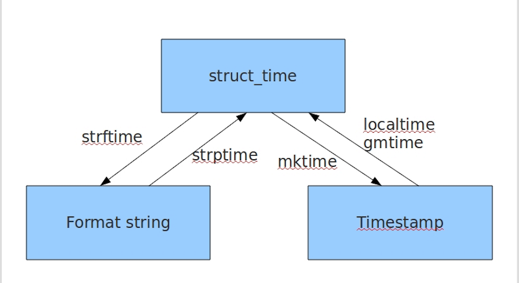
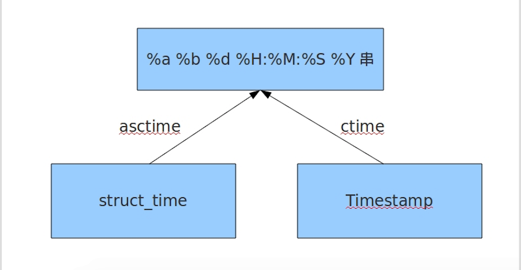

# 模块和包
## 模块的概念
模块就是某功能的代码集合，在Python中，一个.py文件就称之为一个模块（Module）；python的强大之处也就是有非常丰富的模块，避免重复造轮子，开发效率快。

## 模块的好处：
不同功能的代码，分开集中管理，提高了代码的可维护性；其次，编写代码不必从零开始。当一个模块编写完毕，就可以被其他地方引用。我们编写程序的时候也经常引用其他模块，包括python的内置的模块和第三方模块。

## 模块分类：
1. 自定义模块
2. 内置标准模块（又称标准库）
3. 第三方模块(开源模块)

## 模块导入
```
# 1.import  module1,module2,module3,module4
# 导入内置模块

# 2.from  xx import xx 语句
from module  import  func1,func2

from module.xx  import  func1  as f1
# 把来自于modname.xx的name的重新别名，有的方法名很长，可以别名为简写

from module  import   *
# 这提供了一个简单的方法来导入一个模块中的所有项目。这个导入的模块的方法一般不推荐使用，如果引入的其它来源的命名，很有可能覆盖已有的定义。
```
> 模块的运行本质:首先通过sys.pyth找到模块，执行对应文件并且引入变量
```
import sys                          # 可以用import 直接导入内建模块
for i in sys.path:                  # sys.path存放有每次导入模块都会去搜寻的路径
    print(i)
    
#模块运行时通过sys.path的路径一步一步查找模块的
#如果sys.path路劲列表中没有你想要的路径，可以通过sys.path.append("路径")来添加
#当前这是临时添加，如需永久添加则需修改系统的环境变量
import os,sys
BASE_DIR = os.path.dirname(os.path.dirname(os.path.abspath(__file__)))
sys.path.append(BASE_DIR)
```
### 字符串方式导入模块
```
#!/usr/bin/env python
# -*- coding: utf-8 -*-
# Author: Li Sen

# 常规方法
# from m1 import t # 表示m1/t.py
# t.test1()

# 如果是字符串形式的导入

# m=__import__('m1.t') # 只导入顶层m1
# print(m) # <module 'm1' from 'F:\\github\\test\\m1\\__init__.py'>
# m.t.test1()

# import importlib
# m=importlib.import_module("m1.t") # 导入到t
# print(m) # <module 'm1.t' from 'F:\\github\\test\\m1\\t.py'>
# m.test1()

# from m1.t import *
# test1()
# _test2() # 如果类或函数为私有，这样导入是不行的
# from m1.t import _test2 # 得明确导入
# _test2() #
```

## 包的概念：  
如果不同的人编写的模块名相同怎么办？
为了避免模块名冲突，python有引入了按目录组织模块的方法，称为包（Package）  
一个abc.py的文件就是一个名字叫abc的模块。
假设，我们的abc和qaz这两个模块名字与其他模块冲突了，于是我们可以通过包来组织模块，避免冲突，方法是选择一个顶层的包名比如MyUser。  
引入包以后，只要顶层的包名不与别人冲突，那所有的模块都不会与别人冲突。现在abc.py模块的名字就变成了MyUser.abc，qaz模块名字就变成了MyUser.qaz.

> 每个包目录下面都会有一个__init__.py文件，这个文件是必须存在的，否则，python就把这个目录当成普通目录，而不是一个包。 __init__.py可以是空文件，里面可以有程序代码，因为__init__.py就是一个模块，模块名就是对应包的名字，调用包就是执行包下的__init__.py文件。  
自己创建模块时要注意命名，不能和Python自带的模块名称冲突。例如，系统自带了sys模块，自己的模块就不可命名为sys.py，否则将无法导入系统自带的sys模块。

## __name__变量
```
if __name__=='__main__':
       运行代码程序
python文件在本地运行，其__name__ 为 __main__，被当作模块远程调用时__name__为文件名
```

## time模块
三种时间表示
在Python中，通常有这几种方式来表示时间：  
- 时间戳(timestamp)：通常来说，时间戳表示的是从1970年1月1日00:00:00开始按秒计算的偏移量。我们运行“type(time.time())”，返回的是float类型。
- 格式化的时间字符串
- 元组(struct_time)：struct_time元组共有9个元素共九个元素:(年，月，日，时，分，秒，一年中第几周，一年中第几天，夏令时)
```
#!/usr/bin/env python
# -*- coding: utf-8 -*-
# Author: Li Sen

import time

# 1. time.time() 时间戳
# print(time.time())

# 2. time.localtime(second) 加上second（时间戳）转换结构化时间，不加则显示当前的结构化时间
# print(time.localtime())
# 输出为：
# time.struct_time(tm_year=2018, tm_mon=2, tm_mday=28, tm_hour=17, tm_min=29, tm_sec=8, tm_wday=2, tm_yday=59, tm_isdst=0)
# print(time.localtime(1519810731))

# 3. time.gmtime(second) #加上second（时间戳）转换结构化时间（utc时间），不加则显示当前的结构化时间
# print(time.gmtime())
# print(time.gmtime(1519810731))

# 4. mktime()结构化时间转换为时间戳
# print(time.mktime(time.localtime()))

# 5. time.ctime(seconds)#将时间戳转换为格式化时间，不加则返回当前的的格式化时间
# print(time.ctime(1519810962))
# 输出为：
# Wed Feb 28 17:42:42 2018

# 6. time.asctime(p_tuple)#加参数是加一个结构化时间，把结构化时间转换为格式化时间，不加则返回当前的格式化时间
# print(time.asctime())
# print(time.asctime(time.gmtime()))
#
# 7. time.strftime(format,p_tuple)  #把一个结构化时间转化相应的格式化时间
# print(time.strftime("%Y-%m-%d %X",time.localtime()))

# 8. time.strptime(string,format) #把相应的格式时间，转换为结构化时间
# print(time.strptime("2018-2-28 20:22:36","%Y-%m-%d %X"))

# 9. time.sleep(second)#将程序延迟指定的秒数运行
# print(time.sleep(5))

# 10 time.clock()
# 这个需要注意，在不同的系统上含义不同。在UNIX系统上，它返回的是“进程时间”，它是用秒表示的浮点数（时间戳）。
# 而在WINDOWS中，第一次调用，返回的是进程运行的实际时间。而第二次之后的调用是自第一次调用以后到现在的运行
# 时间，即两次时间差。
```
搞清转换图就行了



## random模块
```
#!/usr/bin/env python
# -*- coding: utf-8 -*-
# Author: Li Sen

import random

print(random.random())#随机生成一个小于1的浮点数
print(random.randint(1,3)) #[1-3]随机生成1到3的数
print(random.randrange(1,3)) #[1-3)随机生成1到2的数
print(random.choice([1,'23',[4,5]]))#随机在列表中选取一个元素
print(random.sample([1,'23',[4,5]],2))#随机在列表中选取2个元素
print(random.uniform(1,3))#随机生成1-3的之间的浮点数

item=[1,2,3,4]
random.shuffle(item)
print(item)
```
随机生成5位验证码
```
#!/usr/bin/env python
# -*- coding: utf-8 -*-
# Author: Li Sen

import random

def yz_code():
    code=""
    for i in range(5):
        num=random.randint(0,9)
        alf=chr(random.randint(65,90))
        add=random.choice([num,alf])
        code += str(add)
    return code
print(yz_code())
```

## os模块
os模块是与操作系统交互的一个接口
```
os.getcwd() 获取当前工作目录，即当前python脚本工作的目录路径
os.chdir("dirname")  改变当前脚本工作目录；相当于shell下cd
os.curdir  返回当前目录: ('.')
os.pardir  获取当前目录的父目录字符串名：('..')
os.makedirs('dirname1/dirname2')    可生成多层递归目录
os.removedirs('dirname1')    若目录为空，则删除，并递归到上一级目录，如若也为空，则删除，依此类推
os.mkdir('dirname')    生成单级目录；相当于shell中mkdir dirname
os.rmdir('dirname')    删除单级空目录，若目录不为空则无法删除，报错；相当于shell中rmdir dirname
os.listdir('dirname')    列出指定目录下的所有文件和子目录，包括隐藏文件，并以列表方式打印
os.remove()  删除一个文件
os.rename("oldname","newname")  重命名文件/目录
os.stat('path/filename')  获取文件/目录信息
os.sep    输出操作系统特定的路径分隔符，win下为"\\",Linux下为"/"
os.linesep    输出当前平台使用的行终止符，win下为"\t\n",Linux下为"\n"
os.pathsep    输出用于分割文件路径的字符串 win下为;,Linux下为:
os.name    输出字符串指示当前使用平台。win->'nt'; Linux->'posix'
os.system("bash command")  运行shell命令，直接显示
os.environ  获取系统环境变量
os.path.abspath(path)  返回path规范化的绝对路径
os.path.split(path)  将path分割成目录和文件名二元组返回
os.path.dirname(path)  返回path的目录。其实就是os.path.split(path)的第一个元素
os.path.basename(path)  返回path最后的文件名。如何path以／或\结尾，那么就会返回空值。即os.path.split(path)的第二个元素
os.path.exists(path)  如果path存在，返回True；如果path不存在，返回False
os.path.isabs(path)  如果path是绝对路径，返回True
os.path.isfile(path)  如果path是一个存在的文件，返回True。否则返回False
os.path.isdir(path)  如果path是一个存在的目录，则返回True。否则返回False
os.path.join(path1[, path2[, ...]])  将多个路径组合后返回，第一个绝对路径之前的参数将被忽略
os.path.getatime(path)  返回path所指向的文件或者目录的最后存取时间
os.path.getmtime(path)  返回path所指向的文件或者目录的最后修改时间
```

## sys模块
```
sys.argv           命令行参数List，第一个元素是程序本身路径
sys.exit(n)        退出程序，正常退出时exit(0)
sys.version        获取Python解释程序的版本信息
sys.maxint         最大的Int值
sys.path           返回模块的搜索路径，初始化时使用PYTHONPATH环境变量的值
sys.platform       返回操作系统平台名称
```
BASE_DIR  
BASE_DIR的概念就是执行python所在目录，一般来说我们的python代码是会移动都不同的机器上的，但移动到的所在目录是不同的，比如有的移动在/opt 有的在/usr/local/src等，为了能正常的调用引入自定义的模块，需要把相关文件的目录加入到环境变量中来
```
#!/usr/bin/env python
# -*- coding: utf-8 -*-
# Author: Li Sen

import sys,os
BASE_DIR=os.path.dirname(os.path.dirname(os.path.abspath(__file__)))
sys.path.append(BASE_DIR)

# from my_module import test
# 可以引入模块了
```
进度条
```
#!/usr/bin/env python
# -*- coding: utf-8 -*-
# Author: Li Sen

import sys,time

for i in range(10):
    sys.stdout.write("#")
    time.sleep(1)
    sys.stdout.flush()
```
> sys time 模块是由C编写 集成在python解释器中的 没有独立的python文件

## json & pickle 序列化模块
eval内置方法可以将一个字符串转成python对象，不过，eval方法是有局限性的，对于普通的数据类型，json.loads和eval都能用，但遇到特殊类型的时候，eval就不管用了,所以eval的重点还是通常用来执行一个字符串表达式，并返回表达式的值。  

### 什么是序列化
我们把对象(变量)从内存中变成可存储或传输的过程称之为序列化，在Python中叫pickling，在其他语言中也被称之为serialization，marshalling，flattening等等，都是一个意思。

序列化之后，就可以把序列化后的内容写入磁盘，或者通过网络传输到别的机器上。  
反过来，把变量内容从序列化的对象重新读到内存里称之为反序列化，即unpickling。  

json：用于字符串 和 python数据类型间进行转换  
pickle：用于python特有的类型 和 python的数据类型间进行转换  
Json模块提供了四个功能：dumps、dump、loads、load  
pickle模块提供了四个功能：dumps、dump、loads、load  
其功能基本相同
### json
JSON表示的对象就是标准的JavaScript语言的对象，JSON和Python内置的数据类型对应如下：

```
#!/usr/bin/env python
# -*- coding: utf-8 -*-
# Author: Li Sen

import json

dic={'name':'lisen','age':'20'}
print(type(dic))
j=json.dumps(dic)
print(j)
print(type(j))
# 输出为：
# <class 'dict'>
# {"name": "lisen", "age": "20"}
# <class 'str'>

# 序列化
dic1={'name':'zhangsan','age':'20'}
j1=json.dumps(dic1)
with open("json_dump","w") as f:
    f.write(j1)
# 文件内容：{"name": "zhangsan", "age": "20"} #改为双引号了

# 反序列化
with open("json_dump","r") as f:
    j2=json.loads(f.read())
    print(j2)
# 输出为：{'name': 'zhangsan', 'age': '20'} 改为单引号了

# 特别说明：无论数据是怎样创建的，只要满足json格式，就可以json.loads出来,不一定非要dumps的数据才能loads
dct='{"1":"111"}' # json不认单引号
print(json.loads(dct))

# dump/load： 跟dumps/loads比少了文件write和read操作，目的是直接写入文件,对象是文件，dumps/loads对象是json字符串
dic2={'name':'wangwu','age':'20'}
with open("json_dump2","w") as f:
    json.dump(dic2,f)

with open("json_dump2","r") as f:
    bb=json.load(f)
    print(bb)
```
### pickle
```
#!/usr/bin/env python
# -*- coding: utf-8 -*-
# Author: Li Sen

import pickle

dic={"name":"lisen","age":"22"}

# 序列化
j=pickle.dumps(dic)
print(type(j))
with open("pickle","wb") as f: #注意是w是写入str,wb是写入bytes,j是'bytes'
    f.write(j)
# 等价于pickle.dump(dic,f)

# 反序列化
with open("pickle","rb") as f:
    data=pickle.loads(f.read())
print(data["age"])
# 等价于pickle.load(dic,f)
```

## shelve模块
shelve模块比pickle模块简单，只有一个open函数，返回类似字典的对象，可读可写;key必须为字符串，而值可以是python所支持的数据类型
> 目的：将一个字典写入文本
```
#!/usr/bin/env python
# -*- coding: utf-8 -*-
# Author: Li Sen

import shelve
f=shelve.open(r"shelve")
f['stu1_info']={'name':'alex','age':'18'}
f['stu2_info']={'name':'alvin','age':'20'}
f['school_info']={'website':'oldboyedu.com','city':'beijing'}
f.close()
# 会生成3个文件，三个文件内容不需要搞清楚，也是就是不用搞清的它具体怎么存的，只要掌握它是怎么取数据就行

# 取数据
print(f.get("stu1_info")["age"])
```
## xml模块
xml是实现不同语言或程序之间进行数据交换的协议，跟json差不多，但json使用起来更简单
```
<?xml version="1.0"?>
<data>
    <country name="Liechtenstein">
        <rank updated="yes">2</rank>
        <year>2008</year>
        <gdppc>141100</gdppc>
        <neighbor name="Austria" direction="E"/>
        <neighbor name="Switzerland" direction="W"/>
    </country>
    <country name="Singapore">
        <rank updated="yes">5</rank>
        <year>2011</year>
        <gdppc>59900</gdppc>
        <neighbor name="Malaysia" direction="N"/>
    </country>
    <country name="Panama">
        <rank updated="yes">69</rank>
        <year>2011</year>
        <gdppc>13600</gdppc>
        <neighbor name="Costa Rica" direction="W"/>
        <neighbor name="Colombia" direction="E"/>
    </country>
</data>
```
### xml的增删改查
```
#!/usr/bin/env python
# -*- coding: utf-8 -*-
# Author: Li Sen

import xml.etree.ElementTree as ET

# 解析xml方法1
tree=ET.parse("test.xml") # 解析xml
root=tree.getroot() # 获取根节点
# print(root.tag) # 打印根节点标签

# 解析xml方法2
# str_xml=open("test.xml","r").read()
# root=ET.XML(str_xml)
# print(root.tag)

# 遍历xml文档所有内容
# for child in root:
#     print(child.tag, child.attrib)
#     for i in child:
#         print(i.tag,i.text)

# 只遍历year节点
# for node in root.iter("year"):
#     print(node.tag,node.text)

# 修改节点
# for node in root.iter("year"):
#     # 将year加1
#     new_year=int(node.text) + 1
#     node.text=str(new_year)
#     # 修改属性
#     node.set("update","yes")
#     # 删除属性
#     del node.attrib["update"]
# # 保存文件
# tree.write("test.xml",encoding="utf-8")

# 删除节点
# for country in root.findall("country"): # 遍历data下的所有country节点
#     rank=int(country.find("rank").text) # 获取每一个country节点下rank节点的内容
#     if rank > 50:
#         root.remove(country)
# 
# tree.write("output.xml")
```
### 创建xml
```
#!/usr/bin/env python
# -*- coding: utf-8 -*-
# Author: Li Sen

import xml.etree.ElementTree as ET

# 方法1：
new_xml=ET.Element("data") # 生成根节点
name=ET.SubElement(new_xml,"name",attrib={"update":"yes"})
age=ET.SubElement(name,"age",attrib={"checked":"no"})
sex=ET.SubElement(name,"sex")
sex.text="20"

name2=ET.SubElement(new_xml,"name",attrib={"update":"yes"})
age=ET.SubElement(name2,"age")
age.text="22"

et=ET.ElementTree(new_xml)  #生成文档对象
et.write("create.xml",encoding="utf-8",xml_declaration=False)
```
```
#!/usr/bin/env python
# -*- coding: utf-8 -*-
# Author: Li Sen

import xml.etree.ElementTree as ET

# 方法2：
# 创建根节点
root = ET.Element("famliy")
# 创建节点大儿子
son1 = ET.Element('son', {'name': '儿1'})
# 创建小儿子
son2 = ET.Element('son', {"name": '儿2'})
# 在大儿子中创建两个孙子
grandson1 = ET.Element('grandson', {'name': '儿11'})
grandson2 = ET.Element('grandson', {'name': '儿12'})
grandson1.text="boy"
son1.append(grandson1)
son1.append(grandson2)

# 把儿子添加到根节点中
root.append(son1)
root.append(son1)

tree = ET.ElementTree(root)
tree.write('create2.xml',encoding='utf-8', short_empty_elements=False)
```
```
#!/usr/bin/env python
# -*- coding: utf-8 -*-
# Author: Li Sen

import xml.etree.ElementTree as ET

# 方法3：
from xml.etree import ElementTree as ET
# 创建根节点
root = ET.Element("famliy")
# 创建大儿子
son1 = root.makeelement('son', {'name': '儿1'})
# 创建小儿子
son2 = root.makeelement('son', {"name": '儿2'})
# 在大儿子中创建两个孙子
grandson1 = son1.makeelement('grandson', {'name': '儿11'})
grandson2 = son1.makeelement('grandson', {'name': '儿12'})
grandson2.text="boy"

son1.append(grandson1)
son1.append(grandson2)

# 把儿子添加到根节点中
root.append(son1)
root.append(son1)

tree = ET.ElementTree(root)
tree.write('create3.xml',encoding='utf-8', short_empty_elements=False)
```
### 创建有缩进的xml
```
#!/usr/bin/env python
# -*- coding: utf-8 -*-
# Author: Li Sen

# 原生保存的xml是默认无缩进，如果要设置缩进的话，需要修改保存方式
from xml.etree import ElementTree as ET
from xml.dom import minidom

def prettify(elem):
    """将节点转换成字符串，并添加缩进。
    """
    rough_string = ET.tostring(elem, 'utf-8')
    reparsed = minidom.parseString(rough_string)
    return reparsed.toprettyxml(indent="\t")

# 创建根节点
root = ET.Element("famliy")
# 创建大儿子
son1 = root.makeelement('son', {'name': '儿1'})
# 创建小儿子
son2 = root.makeelement('son', {"name": '儿2'})

# 在大儿子中创建两个孙子
grandson1 = son1.makeelement('grandson', {'name': '儿11'})
grandson2 = son1.makeelement('grandson', {'name': '儿12'})

son1.append(grandson1)
son1.append(grandson2)

# 把儿子添加到根节点中
root.append(son1)
root.append(son1)

raw_str = prettify(root)
f = open("create4.xml",'w',encoding='utf-8')
f.write(raw_str)
f.close()
```
## configparser模块
configparser主要用于配置文件分析用的  
configparser用于处理特定格式的文件，本质上是利用open来操作文件
### 配置文件格式
```
# 注释1
; 注释2
 
[section1] # 节点
k1 = v1    # 值
k2:v2       # 值
 
[section2] # 节点
k1 = v1    # 值
```
### 增删改查
测试文件：
```
[DEFAULT]
ServerAliveInterval = 45
Compression = yes
CompressionLevel = 9
ForwardX11 = yes
  
[bitbucket.org]
User = hg
  
[topsecret.server.com]
Port = 50022
ForwardX11 = no
```
- 查询
```
#!/usr/bin/env python
# -*- coding: utf-8 -*-
# Author: Li Sen

import configparser

# 获取所有节点
config=configparser.ConfigParser() # 初始化一个对象
config.read("test.conf",encoding="utf-8")
ret1=config.sections()
print(ret1)

print('bytebong.com' in config)# False

print(config['bitbucket.org']['User']) # hg

for key in config['bitbucket.org']:
    print(key)
# user
# serveraliveinterval
# compression
# compressionlevel
# forwardx11

# 获取指定节点下所有的键值对
ret2=config.items("bitbucket.org")
print(ret2)

# 获取指定节点下所有的键
ret3=config.options("bitbucket.org")
print(ret3)

v=config.get("bitbucket.org","user")
print(v)
v1=config.getint("topsecret.server.com","port") # 将字符串转为int
print(v1)
print(type(v1))
```
> default块有特殊功能的 遍历其他块 default也会出来 放公共信息其内容他会附加到其他块，此模块是不区分大小写的
- 检查，删除，添加节点
```
#!/usr/bin/env python
# -*- coding: utf-8 -*-
# Author: Li Sen

import configparser

config=configparser.ConfigParser() # 初始化一个对象
config.read("test.conf",encoding="utf-8")

# 检查
has_sec = config.has_section('bitbucket.org') #检查文件中是否有[bitbucket.org]节点，返回True or False
print(has_sec)

# 添加节点
config.add_section("node1")
config.write(open('test.conf', 'w')) #往文件中添加一个节点[node]

# 删除节点 节点下的内容都会被删除
config.remove_section("node1")
config.write(open('test.conf', 'w'))
```
- 检查，删除，设置指定组内的键值对
```
#!/usr/bin/env python
# -*- coding: utf-8 -*-
# Author: Li Sen

import configparser

config=configparser.ConfigParser() # 初始化一个对象
config.read("test.conf",encoding="utf-8")

# 检查
has_opt = config.has_option('topsecret.server.com', 'port')
print(has_opt)

# 删除
config.remove_option('topsecret.server.com', 'port')
config.write(open('test.conf', 'w'))

# 设置
config.set('topsecret.server.com', 'Port', "123") #最后添加到了该节点的末尾
config.write(open('test.conf','w'))
```
- 用configparser生成一个文档
```
#!/usr/bin/env python
# -*- coding: utf-8 -*-
# Author: Li Sen

import configparser

config = configparser.ConfigParser()
config["DEFAULT"] = {'ServerAliveInterval': '45',
                     'Compression': 'yes',
                     'CompressionLevel': '9'}

config['bitbucket.org'] = {}
config['bitbucket.org']['User'] = 'hg'
config['topsecret.server.com'] = {}
topsecret = config['topsecret.server.com']
topsecret['Host Port'] = '50022'
topsecret['ForwardX11'] = 'no'
config['DEFAULT']['ForwardX11'] = 'yes'

with open('test2.conf', 'w') as configfile:
    config.write(configfile)
```

## hashlib模块
用于加密相关的操作，3.x里代替了md5模块和sha模块，主要提供 SHA1, SHA224, SHA256, SHA384, SHA512 ，MD5 算法
```
#!/usr/bin/env python
# -*- coding: utf-8 -*-
# Author: Li Sen

import hashlib

# 加密
# m=hashlib.md5()
m=hashlib.sha256()
m.update("hello".encode("utf8"))
print(m.hexdigest())

# 加盐
hash=hashlib.sha256("123adf".encode("utf8"))
hash.update("hello".encode("utf8"))
print(hash.hexdigest())

# python内置还有一个 hmac 模块，它内部对我们创建 key 和 内容 进行进一步的处理然后再加密
import hmac
h=hmac.new(bytes("123asdf",encoding="utf-8"))
h.update(bytes("admin",encoding="utf-8"))
print(h.hexdigest())
```

## logging模块
### 简要说明
```
#!/usr/bin/env python
# -*- coding: utf-8 -*-
# Author: Li Sen

import logging
logging.debug('debug message')
logging.info('info message')
logging.warning('warning message')
logging.error('error message')
logging.critical('critical message')

# 输出为：
# WARNING:root:warning message
# ERROR:root:error message
# CRITICAL:root:critical message
```
可见，默认情况下Python的logging模块将日志打印到了标准输出中，且只显示了大于等于WARNING级别的日志，这说明默认的日志级别设置为WARNING（日志级别等级CRITICAL > ERROR > WARNING > INFO > DEBUG > NOTSET），默认的日志格式为日志级别：Logger名称：用户输出消息。
### basicConfig
```
#!/usr/bin/env python
# -*- coding: utf-8 -*-
# Author: Li Sen

import logging

logging.basicConfig(level=logging.DEBUG,
                    format='%(asctime)s %(filename)s[line:%(lineno)d] %(levelname)s %(message)s',
                    datefmt='%a, %d %b %Y %H:%M:%S',
                    filename='test.log',
                    filemode='w')

logging.debug('debug message')
logging.info('info message')
logging.warning('warning message')
logging.error('error message')
logging.critical('critical message')

# 文件内容为：
# Tue, 06 Mar 2018 11:19:13 test.py[line:13] DEBUG debug message
# Tue, 06 Mar 2018 11:19:13 test.py[line:14] INFO info message
# Tue, 06 Mar 2018 11:19:13 test.py[line:15] WARNING warning message
# Tue, 06 Mar 2018 11:19:13 test.py[line:16] ERROR error message
# Tue, 06 Mar 2018 11:19:13 test.py[line:17] CRITICAL critical message

```
可见在logging.basicConfig()函数中可通过具体参数来更改logging模块默认行为，可用参数有
```
filename：用指定的文件名创建FiledHandler（后边会具体讲解handler的概念），这样日志会被存储在指定的文件中。
filemode：文件打开方式，在指定了filename时使用这个参数，默认值为“a”(追加)还可指定为“w”。
format：指定handler使用的日志显示格式。 
datefmt：指定日期时间格式。 
level：设置rootlogger（后边会讲解具体概念）的日志级别 
stream：用指定的stream创建StreamHandler。可以指定输出到sys.stderr,sys.stdout或者文件(f=open('test.log','w'))，默认为sys.stderr。若同时列出了filename和stream两个参数，则stream参数会被忽略。
```
format参数中可能用到的格式化串：
```
%(name)s Logger的名字
%(levelno)s 数字形式的日志级别
%(levelname)s 文本形式的日志级别
%(pathname)s 调用日志输出函数的模块的完整路径名，可能没有
%(filename)s 调用日志输出函数的模块的文件名
%(module)s 调用日志输出函数的模块名
%(funcName)s 调用日志输出函数的函数名
%(lineno)d 调用日志输出函数的语句所在的代码行
%(created)f 当前时间，用UNIX标准的表示时间的浮 点数表示
%(relativeCreated)d 输出日志信息时的，自Logger创建以 来的毫秒数
%(asctime)s 字符串形式的当前时间。默认格式是 “2003-07-08 16:49:45,896”。逗号后面的是毫秒
%(thread)d 线程ID。可能没有
%(threadName)s 线程名。可能没有
%(process)d 进程ID。可能没有
%(message)s用户输出的消息
```
### logger对象
logging库提供了多个组件：Logger、Handler、Filter、Formatter。Logger对象提供应用程序可直接使用的接口，Handler发送日志到适当的目的地，Filter提供了过滤日志信息的方法，Formatter指定日志显示格式。

- logger  
logger.setLevel(lel):指定最低的日志级别，低于lel的级别将被忽略。debug是最低的内置级别，critical为最高，logger.setLevel(logging.Debug)  
logger.addFilter(filt)、Logger.removeFilter(filt):添加或删除指定的filter  
logger.addHandler(hdlr)、Logger.removeHandler(hdlr)：增加或删除指定的handler  
logger.debug()、Logger.info()、Logger.warning()、Logger.error()、Logger.critical()：可以设置的日志级别
- handlers
handler对象负责发送相关的信息到指定目的地。Python的日志系统有多种Handler可以使用。有些Handler可以把信息输出到控制台，有些Logger可以把信息输出到文件，还有些 Handler可以把信息发送到网络上。如果觉得不够用，还可以编写自己的Handler。可以通过addHandler()方法添加多个多handler  
handler.setLevel(lel):指定被处理的信息级别，低于lel级别的信息将被忽略  
handler.setFormatter()：给这个handler选择一个格式  
handler.addFilter(filt)、Handler.removeFilter(filt)：新增或删除一个filter对象  
- Formatters
Formatter对象设置日志信息最后的规则、结构和内容，默认的时间格式为%Y-%m-%d %H:%M:%S，跟basicConfig format一致
```
#!/usr/bin/env python
# -*- coding: utf-8 -*-
# Author: Li Sen

import logging

logger=logging.getLogger()
# 创建一个handle，用于写入日志文件
fh=logging.FileHandler("test2.log")

# 再创建一个handle，用于输出到控制台
ch=logging.StreamHandler()

formatter=logging.Formatter('%(asctime)s - %(name)s - %(levelname)s - %(message)s')

fh.setFormatter(formatter) # 配置格式
ch.setFormatter(formatter)

logger.addHandler(fh) # 吸星大法，logger对象可以添加多个fh和ch对象
logger.addHandler(ch)

logger.debug('logger debug message')
logger.info('logger info message')
logger.warning('logger warning message')
logger.error('logger error message')
logger.critical('logger critical message')
```
- 特性
```
#!/usr/bin/env python
# -*- coding: utf-8 -*-
# Author: Li Sen

import logging

##################################################
logger = logging.getLogger()
logger.setLevel(logging.INFO)

logger1 = logging.getLogger('mylogger') # 实际就是上一个mylogger 同一个对象
# logger1 = logging.getLogger('mylogger.sontree') # 添加子节点
logger1.setLevel(logging.DEBUG)

logger2 = logging.getLogger('mylogger') # 实际就是上一个mylogger 同一个对象
logger2.setLevel(logging.INFO)


fh = logging.StreamHandler()
ch = logging.StreamHandler()

logger.addHandler(fh)
logger.addHandler(ch)

logger1.addHandler(fh)
logger1.addHandler(ch)

logger2.addHandler(fh)
logger2.addHandler(ch)

logger.debug('logger debug message')
logger.info('logger info message')
logger.warning('logger warning message')
logger.error('logger error message')
logger.critical('logger critical message')

logger1.debug('logger1 debug message')
logger1.info('logger1 info message')
logger1.warning('logger1 warning message')
logger1.error('logger1 error message')
logger1.critical('logger1 critical message')

logger2.debug('logger2 debug message')
logger2.info('logger2 info message')
logger2.warning('logger2 warning message')
logger2.error('logger2 error message')
logger2.critical('logger2 critical message')
# 输出为
# logger info message
# logger info message
# logger warning message
# logger warning message
# logger error message
# logger error message
# logger critical message
# logger critical message
# logger1 info message
# logger1 info message
# logger1 info message
# logger1 info message
# logger1 warning message
# logger1 warning message
# logger1 warning message
# logger1 warning message
# logger1 error message
# logger1 error message
# logger1 error message
# logger1 error message
# logger1 critical message
# logger1 critical message
# logger1 critical message
# logger1 critical message
# logger2 info message
# logger2 info message
# logger2 info message
# logger2 info message
# logger2 warning message
# logger2 warning message
# logger2 warning message
# logger2 warning message
# logger2 error message
# logger2 error message
# logger2 error message
# logger2 error message
# logger2 critical message
# logger2 critical message
# logger2 critical message
# logger2 critical message
# logger1和logger2对应的是其实是同一个Logger实例mylogger，在logger2实例中通过logger2.setLevel(logging.INFO)设置mylogger的日志级别为logging.INFO，所以最后logger1的输出遵从了后来设置的日志级别。
# 打印两次的原因：子节点打印完自己的内容还会往上找父节点也就是根节点，帮父节点也打印一次
```
- Filter  
限制只有满足过滤规则的日志才会输出。  
比如我们定义了filter = logging.Filter('a.b.c'),并将这个Filter添加到了一个Handler上，则使用该Handler的Logger中只有名字带a.b.c前缀的Logger才能输出其日志。
```
filter = logging.Filter('mylogger') 
logger.addFilter(filter)
这是只对logger这个对象进行筛选
如果想对所有的对象进行筛选，则：
filter = logging.Filter('mylogger') 
fh.addFilter(filter)
ch.addFilter(filter)
这样，所有添加fh或者ch的logger对象都会进行筛选。
```
```
#!/usr/bin/env python
# -*- coding: utf-8 -*-
# Author: Li Sen
import logging

logger = logging.getLogger()
logger.setLevel(logging.DEBUG)

logger1 = logging.getLogger('mylogger')
logger1.setLevel(logging.DEBUG)

# 创建一个handler，用于写入日志文件
fh = logging.FileHandler('test.log')
# 再创建一个handler，用于输出到控制台
ch = logging.StreamHandler()

formatter = logging.Formatter('%(asctime)s - %(name)s - %(levelname)s - %(message)s')
fh.setFormatter(formatter)
ch.setFormatter(formatter)

# 定义一个filter
filter = logging.Filter('mylogger')
fh.addFilter(filter)
ch.addFilter(filter)

logger.addHandler(fh)
logger.addHandler(ch)

logger1.addHandler(fh)
logger1.addHandler(ch)

logger.debug('logger debug message')
logger.info('logger info message')
logger.warning('logger warning message')
logger.error('logger error message')
logger.critical('logger critical message')

logger1.debug('logger1 debug message')
logger1.info('logger1 info message')
logger1.warning('logger1 warning message')
logger1.error('logger1 error message')
logger1.critical('logger1 critical message')

# 只输出logger1日志，logger日志被过滤掉了
```

## re模块
正则表达式（或 RE）是一种小型的、高度专业化的编程语言，主要是对字符串进行模糊匹配。（在Python中）它内嵌在Python中，并通过 re 模块实现。正则表达式模式被编译成一系列的字节码，然后由用 C 编写的匹配引擎执行。
需要导入正则的模块  
import re  
### 元字符：.  ^  $  *  + ?  {}  [] 
```
import re

# . 匹配除了\n换行符之外的任意一个字符
print(re.findall("a.","aabbccabgg")) # ['aa', 'ab']

# ^ 匹配以什么开头的字符
re_str = "ssdfyildazvdfeewrae"
print(re.findall("^s..",re_str))  # ['ssd']  #匹配以s开头后面两个任意字符
print(re.findall("^aa",re_str)) # []  #匹配aa开头

# $ 匹配以什么结尾
re_str = "ssdfyildaaazvdfeewrae"
print(re.findall("ee$",re_str))  #[]
print(re.findall("ae$",re_str))  #['ae']

# * 匹配前面的字符 出现的0-无穷次
re_str = "ssdfyilddddkaaazvdfeewrae"
# print(re.findall("*",re_str)) #报错，要加匹配字符
print(re.findall("d*",re_str))#匹配d出现的0到无穷次 没有，也匹配上了
# ['', '', 'd', '', '', '', '', 'dddd', '', '', '', '', '', '', 'd', '', '', '', '', '', '', '', '']
print(re.findall("ld*k",re_str)) #['lddddk']   #匹配ld*k  匹配*前面的d字符出现的0到无穷次

# + 匹配前面的一个字符出现的1-无穷次 ，最少有1次
re_str = "ssdfyilddddkaaazvddfeewrae"
print(re.findall("dd+",re_str)) # ['dddd', 'dd']  匹配dd+中d出现的一到无穷次
print(re.findall("d+",re_str))  # ['d', 'dddd', 'dd']  匹配d+中d出现的一到无穷次

# ? 匹配前面字符重复零次或一次(有或没有)
name = "asdfqwzerzxcv"
print(re.findall("x?",name)) #匹配x字符出现的0次或者1次
# ['', '', '', '', '', '', '', '', '', 'x', '', '', '']
print(re.findall("zx?",name))  #['z', 'zx']  #匹配zx中x出现的0次或者1次

## 注意点：* + ?等都是贪婪匹配，匹配字符后面加?变成了惰性匹配
re_str = "ssdfyilddddkaaazvddfeewrae"
print(re.findall("dd+?",re_str)) # ['dd', 'dd', 'dd'] 惰性匹配，最小匹配原则

# {} 匹配字符出现的n次，字符{1,n}表示匹配字符出现1到n次
name = "aasdfqwzerzxcvaaaavv"
print(re.findall("aa{1,5}",name)) #['aa', 'aaaa']  #匹配aa a出现的一到5次之间
print(re.findall("aa{1,5}v",name)) #['aaaav']   #匹配aa{1,5}v  ，a出现的一到5次之间
print(re.findall("a{3}",name))  #['aaa'] 只匹配a出现的3次


# [] 字符集匹配字符集中的某一个符号
name = "aasdfqawabcrzxcvabavv"
print(re.findall("a[a]",name))  #['aa'] 只匹配aa
print(re.findall("a[ab]",name))  #['aa', 'ab', 'ab']匹配aa或ab
print(re.findall("f[.q]",name)) #['fq']#匹配f.或者fq

## 注意点：[]里面的字符集都是普通字符，除了- ^ \ 这三个符号在字符集有特殊功能的符号，其它都是普通字符
# - 组成一个范围的数字或字符
name = "aasdfqawzerzxcvaaaavv"
print(re.findall("a[a-z]",name)) #['aa', 'aw', 'aa', 'aa']匹配a[a到z]的任意字符
alp_num = "a12a 34a5567asdfqwer"
print(re.findall("a[0-9 a-z]",alp_num)) #['a1', 'a ', 'a5', 'as']#空格也是普通字符
print(re.findall("a[0-9a-zA-Z]",alp_num)) #['a1', 'a5', 'as']
# ^ 非，取反
name = "aaqa1cvaa"
print(re.findall("[^0-9]",name)) #['a', 'a', 'q', 'a', 'c', 'v', 'a', 'a']把非0到9数字给匹配出来
print(re.findall("a[^0-9]",name)) # ['aa', 'aa'] 把匹配a字符集中非0到9数字给匹配出来
#\ 把普通的特殊字符变得有意义
aa = "advca11234"
print(re.findall("[\d]",aa))    #['1', '1', '2', '3', '4'] \是转义字符，把普通字符，实现特殊的功能
```
常用集合
```
字符类
[0-9]	匹配任何数字。类似于 [0123456789]
[a-z]	匹配任何小写字母
[A-Z]	匹配任何大写字母
[a-zA-Z0-9]	匹配任何字母及数字
[^aeiou]	除了aeiou字母以外的所有字符
[^0-9]	匹配除了数字外的字符
```
### 元字符：\ | ()
反斜杠后面跟元字符去除特殊功能，比如\.  \*  
反斜杠后边跟普通字符实现特殊功能比如\d  
```
\d  匹配任何十进制数；它相当于类 [0-9]。
\D 匹配任何非数字字符；它相当于类 [^0-9]。
\s  匹配任何空白字符；它相当于类 [ \t\n\r\f\v]。
\S 匹配任何非空白字符；它相当于类 [^ \t\n\r\f\v]。
\w 匹配任何字母数字字符；它相当于类 [a-zA-Z0-9_]。
\W 匹配任何非字母数字字符；它相当于类 [^a-zA-Z0-9_]
\b  匹配一个特殊字符边界，比如空格 ，&，＃等
```
```
import re

# \ 转义符
bb = "axs1233_sa _%"
print(re.findall("\d",bb)) #['1', '2', '3', '3']
print(re.findall("\D",bb)) #['a', 'x', 's', '_', 's', 'a', ' ', '_', '%']
print(re.findall("\s",bb)) #[' ']
print(re.findall("\S",bb)) #['a', 'x', 's', '1', '2', '3', '3', '_', 's', 'a', '_', '%']
print(re.findall("\w",bb)) #['a', 'x', 's', '1', '2', '3', '3', '_', 's', 'a', '_']

# 特殊转义
cal = "()(_)(*)(s)12+(28*10+5+2-8-3*(2-1))"
print(re.findall("\(\)",cal)) #['()'] #只匹配普通字符的括号()
print(re.findall("\([\w]\)",cal)) #['(_)', '(s)'] #匹配(任意一个字母数字_)

aa = "\\"
print(aa) # \ python解释器中字符串\\，才表示一个\
print(re.findall("\\\\",aa)) # ['\\'],其实就是一个\

print(re.findall('a\\\\k',"a\k")) # ['a\\k'] 在re中匹配"a\k"是需要规则"a\\k",由于python解释器也需要转义所以为"a\\k"
print(re.findall(r'a\\k',"a\k")) # ['a\\k'] 表示原始字符串(r---> raw string)，表示python解释器不需要做处理和转义


# | 或
test="abccadbb"
print(re.findall("ab|ad",test)) # ['ab', 'ad']

# () 分组，(字符)优先匹配字符里面的内容
tot = "asdasdasdasd"
print(re.findall("(asd)*",tot)) #['asd', ''] #0到无穷匹配
print(re.findall("(asd)+",tot))  #['asd'] #1到无穷匹配
print(re.findall("www\.(baidu|163)\.com","www.baidu.com")) # ['baidu'] findall会优先选择括号中的内容
print(re.findall("www\.(?:baidu|163)\.com","www.baidu.com")) # ['www.baidu.com'] 取消分组优先

# 有名分组
ret=re.search('(?P<id>\d{2})/(?P<name>\w{3})','23/com')
print(ret.group()) #23/com
print(ret.group('id')) #23
print(ret.group('name')) #com
```
## re模块常用方法
```
import re

# findall
print(re.findall("a","aaabac"))  # 返回所有满足匹配条件的结果,放在列表里
# ['a', 'a', 'a', 'a']

# search
print(re.search("a","aaabac").group()) #函数会在字符串内查找模式匹配,只到找到第一个匹配然后返回一个包含匹配信息的对象,该对象可以通过调用group()方法得到匹配的字符串,如果字符串没有匹配，则返回None。
# a

# match
print(re.match("a","ababac")) # 匹配成功re.match方法返回一个匹配位置的对象，否则返回None。(从最开始匹配) 相当于 在search基础上加了^ 以什么开头
# <_sre.SRE_Match object; span=(0, 1), match='a'>
print(re.match("a","bbabac")) # 不符合就返回None
# None
print(re.match("a","ababac").group()) # 获取匹配对象的内容
# a
bb = "advca11234"
print(re.match("adv",bb).span()) #(0, 3) 获取匹配对象的位置
print(re.match("adv",bb).groups()) #() # 获取模型中匹配到的分组结果
print(re.match("adv",bb).groupdict()) #{}  #获取模型中匹配到的分组结果 {}

# sub
phone = "110-119-911-112"
print(re.sub(r"-"," ",phone,count=2)) # 检索字符串的-，把前两个替换成空格，不写默认为所有替换
# 110 119 911-112
print(re.subn(r"-"," ",phone)) # 结果为元组，内容分别为替换后的结果和替换的次数
# ('110 119 911 112', 3)

# split
alp = "a b c  d"
print(re.split("\s+",alp,maxsplit=2))
# ['a', 'b', 'c  d'] # 分割前两个的字符串个空格，以列表形式返回
ret=re.split('[ab]','abcd') # 先按'a'分割得到''和'bcd',在对''和'bcd'分别按'b'分割
print(ret) # ['', '', 'cd']

# finditer
# 把找到的结果做成一个迭代器对象，取值用next()语法和findall一样
phone = "110-119-911-112"
print(re.finditer("\d+",phone)) # <callable_iterator object at 0x0000009E83BCAE10>
te = re.finditer("\d+",phone)
print(next(te).group()) # 110
print(next(te).group()) # 119
print(next(te).group()) # 911

# compile
com=re.compile("\d+") # 将匹配规则独立出来，方便匹配多个结果
print(com.findall("asdf123asdf123")) # ['123', '123']
print(com.findall("asdf111asdf33")) # ['111', '33']
```
> re.match与re.search的区别：  
re.match只匹配字符串的开始，如果字符串开始不符合正则表达式，则匹配失败，函数返回None；
而re.search匹配整个字符串，直到找到一个匹配。

# 作业：计算器
开发一个简单的python计算器  
实现加减乘除及拓号优先级解析
用户输入 1 - 2 * ( (60-30 +(-40/5) * (9-2*5/3 + 7 /3*99/4*2998 +10 * 568/14 )) - (-4*3)/ (16-3*2) )等类似公式后，必须自己解析里面的(),+,-,*,/符号和公式(不能调用eval等类似功能偷懒实现)，运算后得出结果，结果必须与真实的计算器所得出的结果一致
```
#!/usr/bin/env python
# -*- coding: utf-8 -*-
# Author: Li Sen

import re,sys

# 检查输入的表达式
def check_exp(formula):
    check_status=True
    if not formula.count("(") == formula.count(")"):
        print("表达式错误，括号不对称")
        check_status=False
    if re.findall("[a-z]",formula.lower()):
        print("表达式错误，有字母")
        check_status=False
    return check_status

#计算乘除法
def compute_mutiply_and_dividend(formula):
    operators = re.findall(r'[*/]',formula)
    calc_list = re.split('[*/]',formula)
    print(operators)
    print(calc_list)
    calc_res =  None
    for index,i in enumerate(calc_list):
        if calc_res:
            if operators[index - 1] == "*":
                calc_res *= float(i)
            elif operators[index - 1] == "/":
                calc_res /= float(i)
        else:
            calc_res = float(i)
    return calc_res

#计算加减
def compute_add_and_subt(a,b): # a,b经过主逻辑处理已经都为列表了a=['+'] b=['-1', -2.0]
    calc_res =  None
    for index,i in enumerate(b):
        if calc_res:
            if a[index - 1] == "+":
                calc_res += float(i)
            elif a[index - 1] == "-":
                calc_res -= float(i)
        else:
            calc_res = float(i)
    return calc_res

#消除两个符号
def remove(formula):
    formula = formula.replace(" ","")
    formula = formula.replace("+-","-")
    formula = formula.replace("-+", "-")
    formula = formula.replace("++", "+")
    formula = formula.replace("--", "+")
    print(formula)
    return formula

#处理特殊情况 a=['+', '-'] b=['-1', '4/', '2']
def special_done(a,b):
    print("special_a:%s" %a)
    print("special_b:%s" %b)
    for index,i in enumerate(b):
        i = i.strip()
        if i.endswith("*") or i.endswith("/"):
            b[index] = b[index] + a[index] + b[index + 1]
            del b[index + 1]
            del a[index]
    print("special_af_a:%s" %a) # ['+']
    print("special_af_b:%s" %b) # ['-1', '4/-2']
    return a,b

#具体运算
def compute(formula):
    print("compute %s" %formula)
    formula = formula.strip('()')
    a = re.findall(r'[+-]',formula)
    b = re.split(r'[+-]',formula)
    print(a) # ['-', '+', '-']
    print(b) # ['', '1', '4/', '2']
    print(len(b[0].strip()))
    if len(b[0].strip()) == 0:  # (-1+4/-2) 判断如果第一个是减号，值为空了无法运算['', '1', '4/', '2']，将其减号赋下一个值
        b[1] = a[0] + b[1]
        del a[0]
        del b[0]
    print(a) # ['+', '-']
    print(b) # ['-1', '4/', '2']
    a,b = special_done(a,b)
    for index,i in enumerate(b):
        if re.search(r'[*/]',i):
            res = compute_mutiply_and_dividend(i)
            print("乘除计算为结果：%s" %res)
            b[index] = res
    print(a) # ['+']
    print(b) # ['-1', -2.0]
    #开始运算+ -
    total_res=compute_add_and_subt(a,b)
    print("\033[32;1m[%s]运算结果:\033[0m" % formula, total_res)
    return total_res

#主逻辑
def calc(formula):
    calc_status = True
    calc_res = None
    while calc_status:
        m = re.search(r'\([^()]*\)',formula)
        print(m)
        if m:
            sub_res = compute(m.group())
            print(sub_res) # [-1+4/-2]运算结果: -3.0
            formula = formula.replace(m.group(),str(sub_res))
            print(formula)
            formula = remove(formula)
            print(formula)
        else:
            print('\033[41;1m----没拓号了...---\033[0m')

            print('\n\033[42;1m最终结果:\033[0m', compute(formula))
            calc_status = False

# 不清楚先调试此部分
# aa="1+2-4*5+6/2-(-1+4/2-(-1+4/-2))-1"
# calc(aa)
# print(eval(aa))

if __name__=="__main__":
    while True:
        formula=input("请输入要计算的表达式(退出请输入q)：")
        if check_exp(formula):
            calc(formula)
        elif formula.lower()=="q":
            exit()
        else:
            continue
```
