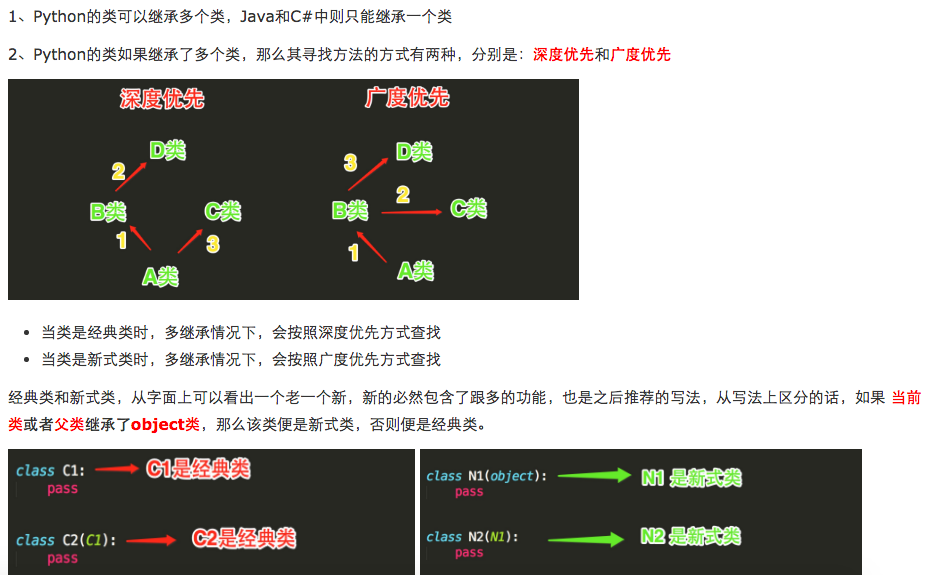

# 面向过程的程序设计
- 核心是过程二字，过程指的是解决问题的步骤，即先干什么再干什么......面向过程的设计就好比精心设计好一条流水线，是一种机械式的思维方式。  
- 优点是：复杂度的问题流程化，进而简单化（一个复杂的问题，分成一个个小的步骤去实现，实现小的步骤将会非常简单）  
- 缺点是：一套流水线或者流程就是用来解决一个问题，生产汽水的流水线无法生产汽车，即便是能，也得是大改，改一个组件，牵一发而动全身。  
- 应用场景：一旦完成基本很少改变的场景，著名的例子有Linux內核，git，以及Apache HTTP Server等。
# 面向对象的程序设计
面向对象的程序设计：核心是对象二字，（要理解对象为何物，必须把自己当成上帝，上帝眼里世间存在的万物皆为对象，不存在的也可以创造出来。  
面向对象的程序设计好比如来设计西游记，如来要解决的问题是把经书传给东土大唐，如来想了想解决这个问题需要四个人：唐僧，沙和尚，猪八戒，孙悟空，每个人都有各自的特征和技能（这就是对象的概念，特征和技能分别对应对象的数据属性和方法属性），然而这并不好玩，于是如来又安排了一群妖魔鬼怪，为了防止师徒四人在取经路上被搞死，又安排了一群神仙保驾护航，这些都是对象。然后取经开始，师徒四人与妖魔鬼怪神仙交互着直到最后取得真经。如来根本不会管师徒四人按照什么流程去取),对象是特征与技能的结合体，基于面向对象设计程序就好比在创造一个世界，你就是这个世界的上帝，存在的皆为对象，不存在的也可以创造出来，与面向过程机械式的思维方式形成鲜明对比，面向对象更加注重对现实世界的模拟，是一种“上帝式”的思维方式。
- 优点是：解决了程序的扩展性。对某一个对象单独修改，会立刻反映到整个体系中，如对游戏中一个人物参数的特征和技能修改都很容易。
- 缺点：
    1. 编程的复杂度远高于面向过程，不了解面向对象而立即上手基于它设计程序，极容易出现过度设计的问题。一些扩展性要求低的场景使用面向对象会徒增编程难度，比如管理linux系统的shell脚本就不适合用面向对象去设计，面向过程反而更加适合。

    2. 无法像面向过程的程序设计流水线式的可以很精准的预测问题的处理流程与结果，面向对象的程序一旦开始就由对象之间的交互解决问题，即便是上帝也无法准确地预测最终结果，只有对象之间交互才能准确地知道最终的结果。
- 应用场景：需求经常变化的软件，一般需求的变化都集中在用户层，互联网应用，企业内部软件，游戏等都是面向对象的程序设计大显身手的好地方
> 三大方法论总结：
> 1. 面向过程：把复杂的任务一步一步分解成简单的任务。
> 2. 函数式编程：将某功能代码封装到函数中，日后便无需重复编写，仅调用函数即可
> 3. 面向对象编程:一种编程方式，需要使用“类”和“对象”来实现，其实就是对“类”和“对象的”使用

# 面向对象设计
- 面向对象设计(Object-oriented design)：将一类的具体的事物的属性和方法整合到一起，即面向对象设计。
> 面向对象(OO)，是一种程序设计思想，不一定只有class定义类才是面向对象，def定义函数的就不是面向对象了，这是一种错误的判断，面向对象是一种思想。
```
#!/usr/bin/env python
# -*- coding: utf-8 -*-
# Author: Li Sen

def person(name,age,gender): # 类
    def play(name): # 人的方法
        print("%s 在玩游戏" %(name["name"]))
    def eat(name): # 人的方法
        print("%s 正在吃饭" %(name["name"]))
    def init(name,age,gender): # 初始化人的属性和方法，也就是将人的属性和方法绑定在一起(局部作用域)
        person1={
            "name":name,
            "age":age,
            "gender":gender,
            "play":play,
            "eat":eat
        }
        return person1
    return init(name,age,gender)

s1=person("lisen",18,"male") # 生成了一个人的实例
print(s1)
s1["play"](s1) # 调用人的方法
s1["eat"](s1)

s2=person("zhangsan",20,"female")
print(s2)
s2["play"](s2)
```
> 这就是用函数完成了一个的简单的面向对象设计

# 面向对象编程
面向对象编程(Object-oriented programming):用定义类+实例/对象的方式去实现面向对象的设计。  
## 类
类(class):具有相同的特征和动作的一类事务就叫做类，它定义了该集合中每个对象所共有的属性和方法。譬如人就是一个类，是具有相同的属性（姓名、性别、年龄等）以及吃喝拉撒的一系列方法（动作）的统称，类是一个抽象概念，对象是类的实例。  
对象(object):基于类定义而创建一个具体的实例就叫做对象。实例就是对象  
实例化：由类产生对象的过程叫实例化
- 定义类的格式
```
# 最基本的格式
class DataClass: # 定义关键字(类名)单词首字母要大写，这是一种规范
    "关于类的注释说明"
    pass #类体

d1=DataClass()  # DataClass()类实例化的过程，实例化一个对象d1
```
python2中的类跟python3中的类
```
前提：
1. 在python2中分新式类和经典类，python3中统一都是新式类。
2. 新式类和经典类声明的最大不同在于，所有新式类必须继承至少一个父类。
3. 所有类不管是否显示声明父类，都有一个默认继承object父类(类的继承，下面会写)
python2中：
经典类：
class 类名:
     pass
 
新式类：
class 类名(父类):
     pass

注：在python3中上面这两种方式都是新式类，没有区别
```
- 属性  
类是用来描述某一个类的事物，类的对象是这一类事物中一个个体  
是事物就要有属性，(类)属性分为：   
1.数据属性：就是变量  
2.函数属性：就是函数，在面向对象中通常称为方法。 
> 类和对象都用点(.)来访问自已的属性  
class.属性  
object.属性  

查看类的属性和方法  
类一般有数据属性和函数属性（也叫方法）
```
!/usr/bin/env python
# -*- coding: utf-8 -*-
# Author: Li Sen

class China:
    person="Chinese"
    def eat_tea(self): # 这个self 是把类实例本身传进去
        print("%s 喜欢喝茶" %self)

# 类中的函数第一个参数必须是self（详细见：类的三大特性之封装）
# 类中定义的函数叫做 “方法”

print(China.person) # 查看类的数据属性
China.eat_tea("lisen") # 调用的类的方法

print(dir(China)) # 查看查出的是类的属性名字的列表
print(China.__dict__) # 查看类的属性字典（数据属性和函数属性）
China.__dict__["eat_tea"]("zhangsan") # 调用
# 输出为：
# Chinese
# lisen 喜欢喝茶
# ['__class__', '__delattr__', '__dict__', '__dir__', '__doc__', '__eq__', '__format__', '__ge__', '__getattribute__', '__gt__', '__hash__', '__init__', '__init_subclass__', '__le__', '__lt__', '__module__', '__ne__', '__new__', '__reduce__', '__reduce_ex__', '__repr__', '__setattr__', '__sizeof__', '__str__', '__subclasshook__', '__weakref__', 'eat_tea', 'person']
# {'__module__': '__main__', 'person': 'Chinese', 'eat_tea': <function China.eat_tea at 0x000002591A48A9D8>, '__dict__': <attribute '__dict__' of 'China' objects>, '__weakref__': <attribute '__weakref__' of 'China' objects>, '__doc__': None}
# zhangsan 喜欢喝茶

# 还有其他的一些属性（基本不用了解就行）
# print(China.__name__) # 类的名字
# print(China.__doc__) # 类的文档字符串
# print(China.__base__) # 类的一个父类（继承会讲）
# print(China.__bases__) # 类的所有父类构成的元组
# print(China.__module____) # 类的定义所在的模块
# print(China.__class______) # 实例对应的类
```
## 对象
### 实例化
```
#!/usr/bin/env python
# -*- coding: utf-8 -*-
# Author: Li Sen

class Chinese:
    "中国人的类"
    def __init__(self,name,age,gender):
        self.name=name
        self.age=age
        self.gender=gender
    def eat_tea(self):
        print("%s 喜欢喝茶" %self.name)


p1=Chinese("lisen",20,"male") # 实例化，得到一个对象p1，p1 就等于self
print(p1) # <__main__.Chinese object at 0x0000018664829518>
```
> - __init__方法，表示实例的初始化，第一个参数永远是self，表示p1实例本身  
> - 在__init__方法内部，就可以把各种属性绑定到self上，因为self就指向了创建的实例本身。在创建实例的时候，必须传入与__init__方法匹配的参数，但self不需要传，python解释器会把自已实例变量传进去。  
> - 和普通函数相比，在类中定义的函数只有一点不同，就是第一参数永远是self，并且，调用时不用传递该参数。除此之外的类的方法和普通函数没什么区别。我们任然可以用函数的其他参数。
### 实例属性
```
#!/usr/bin/env python
# -*- coding: utf-8 -*-
# Author: Li Sen

class Chinese:
    "中国人的类"
    dang="共产党" # 类的数据属性
    def __init__(self,name,age,gender):
        self.name=name
        self.age=age
        self.gender=gender
    def eat_tea(self):  # 类的函数属性也叫方法
        print("%s 喜欢喝茶" %self.name)

# 实例化的过程就是执行__init__的过程，这个函数内部只是为实例本身即self设定了一些变量，所有实例只有数据属性。
p1=Chinese("lisen",20,"male") # 实例化，得到一个对象p1
print(p1) # <__main__.Chinese object at 0x0000018664829518>
print(p1.__dict__) # 查看实例数据属性字典
# {'name': 'lisen', 'age': 20, 'gender': 'male'}

print(p1.dang) # p1的数据字典没有dang,就会调用类的数据字典中的dang
# 实例调用数据属性，如果实例本身的数据字典没有就去类的数据字典里找，类似函数嵌套的作用域一样，但找到类这一层没有就会报错


# 从层级就也可以看出实例只有数据属性，没有函数属性（实例只在__init__方法中），类有数据属性和函数属性，但实例可以调用类的函数属性
Chinese.eat_tea(p1) # 通过类调用方法
p1.eat_tea() # 实例调用类的方法，自己数据字典没有就到类去找，会自动将p1传给eat_tea中的self
```
> - 实例只有数据属性，类有数据跟函数属性，不管是数据属性还是函数属性，如果实例本身属性字典里没有都会去类的属性字典中找
> - 实例只有数据属性，是一个很灵性的设计，实例是本身是千变万化的，比如人的名字，性别，身高等，但一些方法都是共同的，比如吃饭，洗澡，喝茶，这样就设计就利用了函数的代码复用了，既能满足现实使用需求,又能减少代码量，避免内存浪费
## 类属性与对象(实例)属性
### 类属性的增删改查
```
#!/usr/bin/env python
# -*- coding: utf-8 -*-
# Author: Li Sen

class Chinese:
    "中国人的类"
    country="China"
    def __init__(self,name):
        self.name=name
    def eat_tea(self,tea):
        print("%s 正在喝 %s" %(self.name,tea))

p1=Chinese("lisen")
p1.eat_tea("龙井")
Chinese.eat_tea(p1,"龙井")

# 查看
print(Chinese.country)

# 修改
Chinese.country="Japan"
print(Chinese.country)

# 增加数据属性
Chinese.dang="共产党"
print(Chinese.dang)
# 增加函数属性（方法）
def play_basketball(self,name):
    print("%s 在打篮球" %name)
Chinese.play_basketball=play_basketball
print(Chinese.play_basketball)
Chinese.play_basketball(p1,"zhangsan")

# 删除
del Chinese.dang
# print(Chinese.dang)
```
## 实例属性的增删改查
```
#!/usr/bin/env python
# -*- coding: utf-8 -*-
# Author: Li Sen

class Chinese:
    "中国人的类"
    country="China"
    def __init__(self,name):
        self.name=name
    def eat_tea(self,tea):
        print("%s 正在喝 %s" %(self.name,tea))

p1=Chinese("lisen")
p1.eat_tea("龙井")

# 查看
print(p1.name)

# 增加
p1.age=18
print(p1.age)

# 修改
p1.country="Japan"
print(p1.country)
print(p1.__dict__) # {'name': 'lisen', 'age': 18, 'country': 'Japan'}

# 删除
del p1.country
print(p1.__dict__) # {'name': 'lisen', 'age': 18}
```
> 尽管类和实例的属性能修改，但是一般情况是不允许修改的，会造成类错乱

# 静态属性
使用类装饰器@property，将方法（函数属性）变成数据属性，用户调用的时候，让函数的方法看起来像普通属性，以达到封装隐藏方法的逻辑。
```
#!/usr/bin/env python
# -*- coding: utf-8 -*-
# Author: Li Sen

class Room:
    def __init__(self,name,owner,width,length):
        self.name=name
        self.owner=owner
        self.width=width
        self.length=length
    @property
    def cal_area(self):
        return self.width*self.length

r1=Room("排屋","zhangsan",50,50)
# print(r1.cal_area()) # 不加@property，正常使用函数()调用运行，加了@property后运行报错：TypeError: 'int' object is not callable
print(r1.cal_area) # 跟调用r1.name一样，调用者不需要知道函数的背后的逻辑
```
# 类方法
@classmethod类方法，将类方法与实例解绑，引用了cls就跟类绑定了，可以直接通过类调用类方法以及属性
```
#!/usr/bin/env python
# -*- coding: utf-8 -*-
# Author: Li Sen

class Room:
    type="别墅"
    def __init__(self,name,owner,width,length):
        self.name=name
        self.owner=owner
        self.width=width
        self.length=length

    @classmethod
    def test(cls,aa): # cls 代表的是类名，跟self代表是实例一样
        print(cls.type,aa)

Room.test("lisen") # 直接通过类调用类方法，与实例无关
# 别墅 lisen
```
# 静态方法
@staticmethod只是名义上归属类的管理，不能使用类的变量和实例的变量,只是类的工具包，很少用。
经常有一些跟类有关系的功能但在运行时，又不需要实例和类参与的情况下需要用到静态方法，比如更改其他类的属性等能用到的方法。
```
#!/usr/bin/env python
# -*- coding: utf-8 -*-
# Author: Li Sen

class Room:
    def __init__(self,name,owner,width,length):
        self.name=name
        self.owner=owner
        self.width=width
        self.length=length

    @staticmethod
    def play_game(a,b): # 不跟类绑定也不跟实例绑定，也不能调用类和实例的任何属性，只是归类管理，实例可以调用
        print("%s %s 在一起玩游戏" %(a,b))

    def play_ball(c,d): # 这样做毫无意义，实例无法调用（会自动传self），也不归类管理
        print("%s %s 在一起打球" %(c,d))

Room.play_game("zhangsan","lisi")
Room.play_ball("xiaoming","xiaoli")

r1=Room("别墅","lisen",50,50)
r1.play_game("xiaoming","xioali")
# r1.play_ball("xiaoming","xioali") # 报错
```
# 组合
类与类之间没有共同点但有的关联 就可以用组合
- 小的组成大的
```
#!/usr/bin/env python
# -*- coding: utf-8 -*-
# Author: Li Sen

class Head:
    pass
class Body:
    pass
class Foot:
    pass
class Hand:
    pass

class Person:
    def __init__(self,id,name,head,body,foot,hand):
        self.id=id
        self.name=name
        self.head=Head()
        self.body=Body()
        self.foot=Foot()
        self.hand=Hand()
```
- 关联
```
#!/usr/bin/env python
# -*- coding: utf-8 -*-
# Author: Li Sen

class School:
    def __init__(self,name,addr):
        self.name=name
        self.addr=addr

class Course:
    def __init__(self,name,price,school):
        self.name=name
        self.price=price
        self.school=school

class Tearcher:
    def __init__(self,name,school):
        self.name=name
        self.school=school

s1=School("浙大","杭州")
s2=School("北大","北京")
s3=School("交大","上海")

c1=Course("python",200,s1.name)
c2=Course("java",100,s2.name)
c3=Course("go",50,s3.name)

t1=Tearcher("郑强",s1.name)
t2=Tearcher("林建华",s2.name)
t3=Tearcher("林忠钦",s3.name)
info='''
1 浙大 紫金港校区
2 北大 燕园校区
3 交大 闵行校区
'''
info2='''
1 python 200
2 java 100
3 go 50
'''
info3='''
1 郑强
2 林建华
3 林忠钦
'''
while True:
    print(info)
    menu={
        "1":s1,
        "2":s2,
        "3":s3
    }
    choice=input("请选择学校：")
    school_obj=menu[choice]

    print(info2)
    menu2={
        "1":c1,
        "2":c2,
        "3":c3
    }
    course_name=input("课程名：")
    course_obj=menu2[course_name]

    print(info3)
    menu3={
        "1":t1,
        "2":t2,
        "3":t3
    }
    T_name=input("老师名字：")
    T_obj=menu3[T_name]

    new_course=Course(course_obj.name,course_obj.price,school_obj)
    print("您选择的是%s的%s，%s老师教的%s,价格为：%s" %(new_course.school.addr,new_course.school.name,T_obj.name,course_obj.name,new_course.price))
```
# 面向对象编程三大特性
## 继承
### 类的继承:就跟生活中父，子，继承的关系类似，父类又称为基类。  
python中的类的继承分为：单继承和多继承
```
#!/usr/bin/env python
# -*- coding: utf-8 -*-
# Author: Li Sen

class ParentClass1: # 基类
    pass

class ParentClass2: # 基类
    pass

class SubClass1(ParentClass1): # 单继承 子类
    pass

class SubClass2(ParentClass1,ParentClass2): # 多继承
    pass
```
### 子类继承父类的属性
子类继承了父类的所有属性(数据属性和函数属性)，但当子类属性跟父类重名了，就在自己的数据字典中新增，而不是覆盖父类原有
```
#!/usr/bin/env python
# -*- coding: utf-8 -*-
# Author: Li Sen

class Father:
    money= 100
    def __init__(self):
        pass
    def Teach(self):
        print("教育儿子")

class Son(Father):
    money = 100000

s1=Son()
print(Son.__dict__)
print(Father.__dict__)
print(s1.money)
s1.Teach()
# 输出为
# {'__module__': '__main__', 'money': 100000, '__doc__': None}
# {'__module__': '__main__', 'money': 100, '__init__': <function Father.__init__ at 0x00000214F3FFA9D8>, 'Teach': <function Father.Teach at 0x00000214F3FFAA60>, '__dict__': <attribute '__dict__' of 'Father' objects>, '__weakref__': <attribute '__weakref__' of 'Father' objects>, '__doc__': None}
# 100000
# 教育儿子
```
### 继承的使用场景
- 当类之间有显著不同，并且较小的类是较大的类所需要的组件时，用组合比较好

例如：描述一个机器人类，机器人这个大类是由很多互不相关的小类组成，如机械胳膊类、腿类、身体类、电池类

- 当类之间有很多相同的功能，提取这些共同的功能做成基类，用继承比较好

 例如：

猫可以：喵喵叫、吃、喝、拉、撒

狗可以：汪汪叫、吃、喝、拉、撒

如果我们要分别为猫和狗创建一个类，那么就需要为 猫 和 狗 实现他们所有的功能，如下所示：(伪代码说明)
```
class 猫：
 
    def 喵喵叫(self):
        print '喵喵叫'
 
    def 吃(self):
        # do something
 
    def 喝(self):
        # do something
 
    def 拉(self):
        # do something
 
    def 撒(self):
        # do something
 
class 狗：
 
    def 汪汪叫(self):
        print '喵喵叫'
 
    def 吃(self):
        # do something
 
    def 喝(self):
        # do something
 
    def 拉(self):
        # do something
 
    def 撒(self):
        # do something
```
上述代码不难看出，吃，喝、拉、撒是猫和狗都具有的功能，而我们却分别的猫和狗的类中编写了两次。如果使用 继承 的思想，如下实现：

动物：吃、喝、拉、撒

　　   猫：喵喵叫（猫继承动物的功能）

　　   狗：汪汪叫（狗继承动物的功能）

```
class 动物:
 
    def 吃(self):
        # do something
 
    def 喝(self):
        # do something
 
    def 拉(self):
        # do something
 
    def 撒(self):
        # do something
 
# 在类后面括号中写入另外一个类名，表示当前类继承另外一个类
class 猫(动物)：
 
    def 喵喵叫(self):
        print ('喵喵叫')
         
# 在类后面括号中写入另外一个类名，表示当前类继承另外一个类
class 狗(动物)：
 
    def 汪汪叫(self):
        print ("汪汪汪")
```
代码实现：
```
#!/usr/bin/env python
# -*- coding: utf-8 -*-
# Author: Li Sen
class Animal:

    def eat(self):
        print("%s 吃 " % self.name)

    def drink(self):
        print("%s 喝 " % self.name)

    def shit(self):
        print("%s 拉 " % self.name)

    def pee(self):
        print("%s 撒 " % self.name)


class Cat(Animal):

    def __init__(self, name):
        self.name = name
        self.breed = '猫'

    def cry(self):
        print('喵喵叫')


class Dog(Animal):

    def __init__(self, name):
        self.name = name
        self.breed = '狗'

    def cry(self):
        print('汪汪叫')


# ######### 执行 #########

c1 = Cat('黑猫')
c1.eat()

c2 = Cat('白猫')
c2.drink()

d1 = Dog('二哈')
d1.eat()
d1.cry()
```
> 继承同时具有的两种含义：
> - 继承基类的方法，并且做出自已的改变或者扩展(代码重用)
> - 声明某个子类兼容某基类，定义一个接口类，子类继承接口类，并且实现接口中定义的方法。

但是在实践中，继承的第一种含义并不很大，甚至常常是有害的，因为它使得子类与父类出现强耦合。

继承的第二种函数非常重要，又叫“接口继承”，譬如Linux的泛文件概念一样，所有东西都当做文件进行读写处理，不必关心它是内存、还是硬盘、网络等，但必须提供读写方法，一切皆文件。

接口继承实质上是要求作出一个良好的抽象，这个抽象规定了一个兼容接口，使得外部调用者无需关心具体的细节。可一视同仁的处理时限了特定接口的所有对象。这种程序设计上，叫归一化。
```
#!/usr/bin/env python
# -*- coding: utf-8 -*-
# Author: Li Sen

import abc # 必须引入abc模块，python继承并没有实现限制功能

class Read_Write(metaclass=abc.ABCMeta): # 接口继承，规定好必须实现的方法，引入abc模块做强制限制
    @abc.abstractclassmethod # 用此装饰器实现限制
    def read(self):
        pass
    @abc.abstractclassmethod
    def write(self):
        pass

class Disk(Read_Write):
    def read(self):
        print("disk read")
    def write(self):
        print("disk write")

class  Cdrom(Read_Write):
    def read(self):
        print("cdrom write")

c1=Cdrom() # 报错，没有实现write方法
# Traceback (most recent call last):
#   File "F:/github/test/test1.py", line 25, in <module>
#     c1=Cdrom()
# TypeError: Can't instantiate abstract class Cdrom with abstract methods write
```
### 继承顺序
- python的类可以继承多个类，java和c#只能继承一个类
- python2的类如果继承了多个类，寻找方法有两种：深度优先和广度优先

- python3中的继承顺序
python对类的继承顺序。是根据mro列表来继承的，这个mro列表就是基于你定义的每个类，通过一个C3线性算法来实现的。
为了实现继承,python会在MRO列表上从左到右开始查找基类,直到找到第一个匹配这个属性的类为止。

所有父类的MRO列表并遵循如下三条准则:
1.子类会先于父类被检查
2.多个父类会根据它们在列表中的顺序被检查
3.如果对下一个类存在两个合法的选择,选择第一个父类
```
#!/usr/bin/env python
# -*- coding: utf-8 -*-
# Author: Li Sen

class A:
    def test(self):
        print("A")
class B(A):
    # def test(self):
    #     print("B")
    pass
class C(A):
    def test(self):
        print("C")
class D(B):
    # def test(self):
    #     print("D")
    pass
class E(C):
    def test(self):
        print("E")
class F(D,E):
    # def test(self):
    #     print("F")
    pass
f = F()
f.test()
print(F.__mro__) # python3中类继承顺序：F->D->B->E->C->A
# E
# (<class '__main__.F'>, <class '__main__.D'>, <class '__main__.B'>, <class '__main__.E'>, <class '__main__.C'>, <class '__main__.A'>, <class 'object'>)
```
### 子类调用父类的方法
- 方法一：父类名.父类方法() # 不建议使用，强耦合，一旦父类改名，子类相关引用都得改
```
#!/usr/bin/env python
# -*- coding: utf-8 -*-
# Author: Li Sen

class Vehicle:
    country="china"
    def __init__(self,name,speed,load,power):
        self.name=name
        self.speed=speed
        self.load=load
        self.power=power

    def run(self):
        print("开始起飞了。。。")

class Subway(Vehicle):
    def __init__(self,name,speed,load,power,line):
        Vehicle.__init__(self,name,speed,load,power)
        self.line=line

    def run(self):
        Vehicle.run(self)
        print("地铁%s号线欢迎您" %self.line)

line13=Subway("中国地铁","20m/s","100/车厢","电",13)
line13.run()
```
- 方法二：super()
```
#!/usr/bin/env python
# -*- coding: utf-8 -*-
# Author: Li Sen

class Vehicle:
    country="china"
    def __init__(self,name,speed,load,power):
        self.name=name
        self.speed=speed
        self.load=load
        self.power=power

    def run(self):
        print("开始起飞了。。。")

class Subway(Vehicle):
    def __init__(self,name,speed,load,power,line):
        # Vehicle.__init__(self,name,speed,load,power)
        super().__init__(name,speed,load,power)
        # super(Subway,self).__init__(name,speed,load,power) # 等同于上面，另一种写法
        self.line=line

    def run(self):
        # Vehicle.run(self)
        super().run()
        print("地铁%s号线欢迎您" %self.line)

line13=Subway("中国地铁","20m/s","100/车厢","电",13)
line13.run()
```
## 多态
python中的标准类型就是多态概念的一个很好的示范如（str.\_\_len__(),list.\_\_len__(),tuple.__len__可以len(str),len(list),len(tuple)）
python中的多态是指调用不同的类实例化得到的对象下的相同方法，实质上是类继承的一种体现  

例:
```
#!/usr/bin/env python
# -*- coding: utf-8 -*-
# Author: Li Sen

class H2o:
    def __init__(self,name,temperature):
        self.name=name
        self.temperature=temperature

    def turn(self):
        if self.temperature <0:
            print("[%s] 温度太低，结冰了" %self.name)
        elif self.temperature > 0 and self.temperature < 100:
            print("[%s] 温度正常，水还是水" %self.name)
        elif self.temperature > 100:
            print("[%s] 温度太高，水蒸气了" %self.name)

class Water(H2o):
    pass

class Ice(H2o):
    pass

class Steam(H2o):
    pass

w1=Water('水',25)
i1=Ice('水',-20)
s1=Steam('水',300)

w1.turn()
i1.turn()
s1.turn()
```
## 封装
封装有两个含义：一是把一堆功能打包装起来，二是把装起来的东西封起来，对内部透明，对外隐藏，明确的区分内外

命名约定来表明封装，python没有严格意义上的封装：
- 单下划线开头的对象名称，约定为内部的
```
#!/usr/bin/env python
# -*- coding: utf-8 -*-
# Author: Li Sen

class People:
    _star="earth"
    def __init__(self,id,name,age):
        self.id=id
        self.name=name
        self._age=age

    def _get_id(self):
        print("我是私有方法，我找的是年纪%s" %self._age)

print(People._star)
p1=People('1231231','zhangsan',20)
print(p1._age)
p1._get_id()
# 输出为：
# earth
# 20
# 我是私有方法，我找的是年纪20
```
python不会真正阻止你访问内部属性，这是一种约定，表明他是内部属性，不应该外部调用

- 双下划线开头的对象名称
```
#!/usr/bin/env python
# -*- coding: utf-8 -*-
# Author: Li Sen

class People:
    __star="earth"
    def __init__(self,id,name,age):
        self.id=id
        self.name=name
        self.__age=age

    def __get_id(self):
        print("我是私有方法，我找的是年纪%s" %self.__age)

# print(People.__star) # 直接调用不能访问
print(People._People__star)
p1=People('1231231','zhangsan',20)
print(People.__dict__)
print(p1._People__star)
# print(p1.__age) # 不能访问
p1._People__get_id()
```
改为双下划线后，强行直接调用内部属性名看似是不行的，实际上是可以的，只是要改变下方式，因为双下划线会被python重命名，之所以这样设计是避免我们滥用封装；通过这种约定，使得封装明确区分内外，修改内部相关属性不影响外部调用，外部调用也清楚哪些属性是可以调用哪些是不可以。
