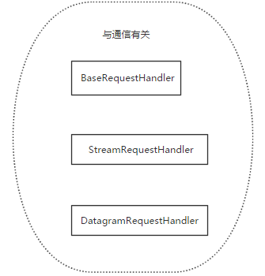

# osi七层模型
说到网络编程，就不得不说下osi七层模型了，这里就一张图带过，详细说明自行搜索

# TCP三次握手和四次挥手
这里详细说下TCP的三次握手以及四次挥手
## TCP报文格式


上图中有几个字段需要重点介绍下：  
  （1）序号：Seq序号，占32位，用来标识从TCP源端向目的端发送的字节流，发起方发送数据时对此进行标记。  
  （2）确认序号：Ack序号，占32位，只有ACK标志位为1时，确认序号字段才有效，Ack=Seq+1。  
  （3）标志位：共6个，即URG、ACK、PSH、RST、SYN、FIN等，具体含义如下：  
     （A）URG：紧急指针（urgent pointer）有效。  
     （B）ACK：确认序号有效。 
     （C）PSH：接收方应该尽快将这个报文交给应用层。  
     （D）RST：重置连接。  
     （E）SYN：发起一个新连接。 
     （F）FIN：释放一个连接。  
> 不要将确认序号Ack与标志位中的ACK搞混了，确认方Ack=发起方Req+1，两端配对。   

## 三次握手
所谓的“三次握手”即对每次发送的数据量跟踪进行协商使数据段的发送和接收同步，以及根据所接收到的数据量来确定数据发送、接收完毕后何时撤消联系，并建立虚连接。  
第一次握手：主机A发送标志位为SYN＝1 ,seq number=x(随机序号) ack number=0的数据包到服务器，主机B由SYN=1知道，A要求建立联机，此时状态为SYN_SENT；  

第二次握手：主机B收到请求后要确认联机信息，向A发送标志位SYN=1,ACK=1, seq number=y(随机序号),ack number=(x+1)的包，此时状态由LISTEN变为SYN_RCVD；  

第三次握手：主机A收到后检查ack number是否正确，即第一次发送的seq number x+1,以及位码ack是否为1。 

若正确，主机A会再发送ACK=1,ack number=(主机B的seq number y+1)，主机B收到后确认ack number值与ACK=1则连接建立成功，双方状态ESTABLISHED。  
完成三次握手，主机A与主机B开始传送数据。  

### 状态说明：
CLOSED: 这个没什么好说的了，表示初始状态。  

LISTEN: 这个也是非常容易理解的一个状态，表示服务器端的某个SOCKET处于监听状态，可以接受连接了。  

SYN_RCVD: 这个状态表示接受到了SYN报文，在正常情况下，这个状态是服务器端的SOCKET在建立TCP连接时的三次握手会话过程中的一个中间状态，很短暂，基本 上用netstat你是很难看到这种状态的，除非你特意写了一个客户端测试程序，故意将三次TCP握手过程中最后一个ACK报文不予发送。因此这种状态 时，当收到客户端的ACK报文后，它会进入到ESTABLISHED状态。  

SYN_SENT: 这个状态与SYN_RECV遥想呼应，当客户端SOCKET执行CONNECT连接时，它首先发送SYN报文，因此也随即它会进入到了SYN_SENT状 态，并等待服务端的发送三次握手中的第2个报文。SYN_SENT状态表示客户端已发送SYN报文。  

ESTABLISHED：这个容易理解了，表示连接已经建立了。


### 为什么是三次握手？
三次握手可以建立双向连接，两次握手只能建立一条单向的连接。 
TCP三次握手最重要的目的就是建立双向连接，这样能建立可靠的信道，保证数据可靠的传输；同时三次握手是保证可靠性的最少次数，效率最高；也很好的避免了已失效的连接请求报文段突然又传送到了服务端，因而产生错误。  
- 效率最高  
  tcp建立连接过程，其实是双方各一次握手，各一次确认，但其中一次握手和确认合并在一起
- 已失效的连接请求报文段的产生  
client发出的第一个连接请求报文段并没有丢失，而是在某个网络结点长时间的滞留了，以致延误到连接释放以后的某个时间才到达server。  
本来这是一个早已失效的报文段，但server收到此失效的连接请求报文段后，就误认为是client再次发出的一个新的连接请求。于是就向client发出确认报文段，同意建立连接。  
假设不采用“三次握手”，那么只要server发出确认，新的连接就建立了；由于现在client并没有发出建立连接的请求，因此不会理睬server的确认，也不会向server发送数据，但server却以为新的运输连接已经建立，并一直等待client发来数据。这样，server的很多资源就白白浪费掉了。  
采用“三次握手”的办法可以防止上述现象发生。例如刚才那种情况，client不会向server的确认发出确认。server由于收不到确认，就知道client并没有要求建立连接。”

### 为什么采用随机初始序列号？
从安全的角度来说，TCP序列号初始值越趋近于随机越好，算法越复杂越好。  
如果不是随机产生初始序列号，黑客将会很容易的获取到你与其他主机之间通信的初始化序列号，并且伪造序列号进行攻击

## 四次挥手
由于TCP连接时全双工的，因此，每个方向都必须要单独进行关闭，这一原则是当一方完成数据发送任务后，发送一个FIN来终止这一方向的连接，收到一个FIN只是意味着这一方向上没有数据流动了，即不会再收到数据了，但是在这个TCP连接上仍然能够发送数据，直到这一方向也发送了FIN。首先进行关闭的一方将执行主动关闭，而另一方则执行被动关闭，上图描述的即是如此。  
 第一次挥手：A发送一个标志位FIN=1 ACK=1，seq number=a  ack number=b用来关闭A到B的数据传送，A进入FIN_WAIT_1状态。  
 第二次挥手：B收到FIN后，发送一个标志位ACK=1，seq number=b（与SYN相同，一个FIN占用一个序号）ack number=a+1的包给A，B进入CLOSE_WAIT状态。  
 第三次挥手：B发送一个标志位FIN=1 ACK=1，seq number=c ack number=a+1，用来关闭B到A的数据传送，B进入LAST_ACK状态。  
 第四次挥手：A收到FIN后，A进入TIME_WAIT状态，接着发送一个ACK=1，seq number=a+1 ack number=c+1的包给B，B进入CLOSED状态，完成四次挥手。
 


### 为什么建立连接协议是三次握手，而关闭连接却是四次握手呢？
这是因为服务端的LISTEN状态下的SOCKET当收到SYN报文的建连请求后，它可以把ACK和SYN（ACK起应答作用，而SYN起同步作用）放在一个报文里来发送。但关闭连接时，当收到对方的FIN报文通知时，它仅仅表示对方没有数据发送给你了；但未必你所有的数据都全部发送给对方了，所以你可以未必会马上会关闭SOCKET,也即你可能还需要发送一些数据给对方之后，再发送FIN报文给对方来表示你同意现在可以关闭连接了，所以它这里的ACK报文和FIN报文多数情况下都是分开发送的.

### 为什么TIME_WAIT状态还需要等2MSL后才能返回到CLOSED状态？
 这是因为虽然双方都同意关闭连接了，而且握手的4个报文也都协调和发送完毕，按理可以直接回到CLOSED状态（就好比从SYN_SEND状态到ESTABLISH状态那样）；但是因为我们必须要假想网络是不可靠的，你无法保证你最后发送的ACK报文会一定被对方收到，因此对方处于LAST_ACK状态下的SOCKET可能会因为超时未收到ACK报文，而重发FIN报文，所以这个TIME_WAIT状态的作用就是用来重发可能丢失的ACK报文。
为了这种情况： B向A发送 FIN = 1 的释放连接请求，但这个报文丢失了， A没有接到不会发送确认信息， B 超时会重传，这时A在 WAIT_TIME 还能够接收到这个请求，这时再回复一个确认就行了。（A收到 FIN = 1 的请求后 WAIT_TIME会重新记时）
RFC 793中规定MSL为2分钟，实际应用中常用的是30秒，1分钟和2分钟等

### SYN攻击
在三次握手过程中，Server发送SYN-ACK之后，收到Client的ACK之前的TCP连接称为半连接（half-open connect），此时Server处于SYN_RCVD状态，当收到ACK后，Server转入ESTABLISHED状态。SYN攻击就是Client在短时间内伪造大量不存在的IP地址，并向Server不断地发送SYN包，Server回复确认包，并等待Client的确认，由于源地址是不存在的，因此，Server需要不断重发直至超时，这些伪造的SYN包将长时间占用未连接队列，导致正常的SYN请求因为队列满而被丢弃，从而引起网络堵塞甚至系统瘫痪。SYN攻击时一种典型的DDOS攻击，检测SYN攻击的方式非常简单，即当Server上有大量半连接状态且源IP地址是随机的，则可以断定遭到SYN攻击了，使用如下命令可以让之现行：
```
netstat -nap | grep SYN_RECV
```
# Socket
Socket是应用层与TCP/IP协议族通信的中间软件抽象层，它是一组接口。在设计模式中，Socket其实就是一个门面模式，它把复杂的TCP/IP协议族隐藏在Socket接口后面，对用户来说，一组简单的接口就是全部，让Socket去组织数据，以符合指定的协议。  
Socket一般可以用ip+port来代称，ip是用来标识互联网中的一台主机的位置，而port是用来标识这台机器上的一个应用程序，ip地址是配置到网卡上的，而port是应用程序开启的，ip与port的绑定就标识了互联网中独一无二的一个应用程序。
## 套接字分类
套接字起源于 20 世纪 70 年代加利福尼亚大学伯克利分校版本的 Unix,即人们所说的 BSD Unix。 因此,有时人们也把套接字称为“伯克利套接字”或“BSD 套接字”。一开始,套接字被设计用在同 一台主机上多个应用程序之间的通讯。这也被称进程间通讯,或 IPC。套接字有两种（或者称为有两个种族）,分别是基于文件型的和基于网络型的。 
- 基于文件类型的套接字家族
  套接字家族的名字：AF_UNIX  
  unix一切皆文件，基于文件的套接字调用的就是底层的文件系统来取数据，两个套接字进程运行在同一机器，可以通过访问同一个文件系统间接完成通信

- 基于网络类型的套接字家族
  套接字家族的名字：AF_INET   
  还有AF_INET6被用于ipv6，还有一些其他的地址家族，不过，他们要么是只用于某个平台，要么就是已经被废弃，或者是很少被使用，或者是根本没有实现，所有地址家族中，AF_INET是使用最广泛的一个，python支持很多种地址家族，但是由于我们只关心网络编程，所以大部分时候我么只使用AF_INET

### 套接字工作流程
先从服务器端说起。服务器端先初始化Socket，然后与端口绑定(bind)，对端口进行监听(listen)，调用accept阻塞，等待客户端连接。在这时如果有个客户端初始化一个Socket，然后连接服务器(connect)，如果连接成功，这时客户端与服务器端的连接就建立了。客户端发送数据请求，服务器端接收请求并处理请求，然后把回应数据发送给客户端，客户端读取数据，最后关闭连接，一次交互结束。
### 常用socket方法
```
服务端套接字函数
s.bind()    绑定(主机,端口号)到套接字
s.listen()  开始TCP监听
s.accept()  被动接受TCP客户的连接,(阻塞式)等待连接的到来

客户端套接字函数
s.connect()     主动初始化TCP服务器连接
s.connect_ex()  connect()函数的扩展版本,出错时返回出错码,而不是抛出异常

公共用途的套接字函数
s.recv()            接收TCP数据
s.send()            发送TCP数据(send在待发送数据量大于己端缓存区剩余空间时,数据丢失,不会发完)
s.sendall()         发送完整的TCP数据(本质就是循环调用send,sendall在待发送数据量大于己端缓存区剩余空间时,数据不丢失,循环调用send直到发完)
s.recvfrom()        接收UDP数据
s.sendto()          发送UDP数据
s.getpeername()     连接到当前套接字的远端的地址
s.getsockname()     当前套接字的地址
s.getsockopt()      返回指定套接字的参数
s.setsockopt()      设置指定套接字的参数
s.close()           关闭套接字

面向锁的套接字方法
s.setblocking()     设置套接字的阻塞与非阻塞模式
s.settimeout()      设置阻塞套接字操作的超时时间
s.gettimeout()      得到阻塞套接字操作的超时时间

面向文件的套接字的函数
s.fileno()          套接字的文件描述符
s.makefile()        创建一个与该套接字相关的文件
```
### tcp socket
tcp socket基本流程（伪代码）
```
# 服务端，tcp是基于链接的，必须先启动服务端，然后再启动客户端去链接服务端
ss = socket() #创建服务器套接字
ss.bind()      #把地址绑定到套接字
ss.listen()      #监听链接
inf_loop:      #服务器无限循环
    cs = ss.accept() #接受客户端链接
    comm_loop:         #通讯循环
        cs.recv()/cs.send() #对话(接收与发送)
    cs.close()    #关闭客户端套接字
ss.close()        #关闭服务器套接字(可选)

# 客户端
cs = socket()    # 创建客户套接字
cs.connect()    # 尝试连接服务器
comm_loop:        # 通讯循环
    cs.send()/cs.recv()    # 对话(发送/接收)
cs.close()            # 关闭客户套接字
```
tcp socket通信流程与打电话流程类似，我们就以打电话为例来实现一个套接字通信

server端：
```
#!/usr/bin/env python
# -*- coding: utf-8 -*-
# Author: Li Sen

import socket

ip_port=('127.0.0.1',8001)
BS=1024 # 数据缓冲区的大小，字节

s=socket.socket(socket.AF_INET,socket.SOCK_STREAM)  # 网络socket,tcp方式
s.bind(ip_port)
s.listen(5) # 最大监听数


while 1: # 循环不断接电话
    print("server正在监听")
    conn,addr=s.accept() # 元组
    print(conn) # 双向连接，一个socket对象，好比电话线
    print(addr) # 客户端socket地址, 好比电话号码
    print('接到来自%s的电话' %addr[0])
    while 1:
        msg=conn.recv(BS) # 字节流，二进制数据，bytes类型
        if not msg: # 如果不加,那么正在链接的客户端突然断开,recv便不再阻塞,死循环发生（mac出现死循环，Windows和Linux直接报错）
            break
        print(msg,type(msg))
        print('客户端发来的消息是%s' %msg.decode("utf-8")) # 需转换，发送的用什么编码就用什么解码
        conn.send(msg.upper()) # 发消息，说话，转成大写
    conn.close() # 挂电话

s.close() # 手机关机
```
client端：
```
#!/usr/bin/env python
# -*- coding: utf-8 -*-
# Author: Li Sen

import socket
ip_port=('127.0.0.1',8001)
BS=1024 # 数据缓冲区的大小，字节

s=socket.socket(socket.AF_INET,socket.SOCK_STREAM)

s.connect_ex(ip_port) # 相当于拨电话

while 1: # 循环不断发消息
    msg=input("输出发送内容：").strip()
    if len(msg) == 0: # 防止发空消息
        continue
    s.send(msg.encode('utf-8')) # 发消息，说话，默认是bytes类型

    feedback=s.recv(BS)  # 收消息，听电话
    print('接收到的消息：',feedback.decode('utf-8'))

s.close()
```
> 连续运行示例会出现地址占用的情况，具体就是四次挥手后time_wait状态在占用地址
解决方式：
1. 重用socket地址
```
#加入一条socket配置，重用ip和端口

phone=socket(AF_INET,SOCK_STREAM)
phone.setsockopt(SOL_SOCKET,SO_REUSEADDR,1) #就是它，在bind前加
phone.bind(('127.0.0.1',8080))
```
2. 调整内核参数，缩短time_wait时间：
```
发现系统存在大量TIME_WAIT状态的连接，通过调整linux内核参数解决，
vim /etc/sysctl.conf

编辑文件，加入以下内容：
net.ipv4.tcp_syncookies = 1
net.ipv4.tcp_tw_reuse = 1
net.ipv4.tcp_tw_recycle = 1
net.ipv4.tcp_fin_timeout = 30
 
然后执行 /sbin/sysctl -p 让参数生效。
 
net.ipv4.tcp_syncookies = 1 表示开启SYN Cookies。当出现SYN等待队列溢出时，启用cookies来处理，可防范少量SYN攻击，默认为0，表示关闭；
net.ipv4.tcp_tw_reuse = 1 表示开启重用。允许将TIME-WAIT sockets重新用于新的TCP连接，默认为0，表示关闭；
net.ipv4.tcp_tw_recycle = 1 表示开启TCP连接中TIME-WAIT sockets的快速回收，默认为0，表示关闭。
net.ipv4.tcp_fin_timeout 修改系統默认的 TIMEOUT 时间
```
### udp socket
udp 是无连接的，是不可靠的
基本流程：(伪代码)
```
# server
ss = socket()   #创建一个服务器的套接字
ss.bind()       #绑定服务器套接字
while True:       #服务器无限循环
     cs = ss.recvfrom()/ss.sendto() # 对话(接收与发送)
ss.close() 
 
# client
cs = socket()   # 创建客户套接字
while True:      # 通讯循环
    cs.sendto()/cs.recvfrom()   # 对话(发送/接收)
cs.close()                      # 关闭客户套接字
```
- 示例：模拟qq聊天  
由于udp无3次握手链接，所以可以同时多个客户端去跟服务端通信

server端：
```
#!/usr/bin/env python
# -*- coding: utf-8 -*-
# Author: Li Sen

from socket import *

address=("127.0.0.1",8080)
bs=1024
us=socket(AF_INET,SOCK_DGRAM) # udp
us.bind(address)

while 1:
    msg,addr=us.recvfrom(bs)
    print("来自%s,%s的一条消息:%s" %(addr[0],addr[1],msg.decode('utf-8')))
    back_msg=input("回复：").strip()
    us.sendto(back_msg.encode("utf-8"),addr)
```
client端：
```
#!/usr/bin/env python
# -*- coding: utf-8 -*-
# Author: Li Sen

from socket import *


uc=socket(AF_INET,SOCK_DGRAM)
bs=1024
qq_name_dict={
    '张三':('127.0.0.1',8080),
    '李四':('127.0.0.1',8080),
    '王五':('127.0.0.1',8080)
}

while 1:
    for i in qq_name_dict:
        print(i)

    qq_name=input("请选择聊天对象：")
    if not qq_name or qq_name not in qq_name_dict: continue
    while 1:
        msg=input("输入聊天内容：")
        if msg == 'quit': break
        if not msg:continue
        uc.sendto(msg.encode('utf-8'),qq_name_dict[qq_name])

        back_msg,addr=uc.recvfrom(bs)
        print('来自%s:%s的一条消息：%s' %(addr[0],addr[1],back_msg.decode('utf-8')))
uc.close()
```
> 无论客户端还是服务器端，收发消息都是在自己的数据缓冲区操作

总结：

1. tcp是基于有连接协议，通信前得建立连接（三次握手，四次挥手），send跟recv没有对应关系，数据收发是可靠的，但如果没有相关设置，会粘包。
如果收消息缓冲区里的数据为空，那么recv就会阻塞；如果一端断开了链接，那另一端的链接也会中断，此时recv将不会阻塞。

2. udp是基于无连接协议，通信前不需要建立连接，但sendto跟recvfrom需要一一对应，否则会丢失整个消息，如果recvfrom收的数据小于sendto发的数据，会直接丢弃多余部分的消息，所以udp是不会产生粘包。

# 粘包
- tcp是面向连接的，提供高可靠性服务。收发两端（客户端和服务器端）都要有一一成对的socket，因此，发送端为了将多个发往接收端的包，更有效的发到对方，使用了优化方法（Nagle算法），将多次间隔较小且数据量小的数据，合并成一个大的数据块，然后进行封包，这样，接收端，就难于分辨出来了，会引起粘包；如果发送一个超大的数据包，tcp不会丢弃超额的数据，下次接收会继续上次位置进行，数据是可靠的，这样也会粘包。

示例1：发送端需要等缓冲区满才会发送出去，造成粘包（发生数据时间的间隔很短，数据量很小，回合到一起，产生粘包）
server端
```
#!/usr/bin/env python
# -*- coding: utf-8 -*-
# Author: Li Sen

from socket import *
ip_port=('127.0.0.1',8080)
back_log=5
buffer_size=1024

tcp_server=socket(AF_INET,SOCK_STREAM)
tcp_server.setsockopt(SOL_SOCKET,SO_REUSEADDR,1)
tcp_server.bind(ip_port)
tcp_server.listen(back_log)

conn,addr=tcp_server.accept()

data1=conn.recv(buffer_size) # 一次性全收过来了
print('第1次数据',data1)

data2=conn.recv(buffer_size) # 收空
print('第2次数据',data2)

data3=conn.recv(buffer_size) # 收空
print('第3次数据',data3)

# 输出为：
# 第1次数据 b'helloworldegon'
# 第2次数据 b''
# 第3次数据 b''
```
client端
```
#!/usr/bin/env python
# -*- coding: utf-8 -*-
# Author: Li Sen

from socket import *
ip_port=('127.0.0.1',8080)

tcp_client=socket(AF_INET,SOCK_STREAM)
tcp_client.connect(ip_port)

tcp_client.send('hello'.encode('utf-8'))
tcp_client.send('world'.encode('utf-8'))
tcp_client.send('egon'.encode('utf-8'))
```
示例2：接收方接收缓冲区小于发送的数据包，造成多个包接收（客户端发送了一段大数据，服务端只收了一部份，服务端下次再收的时候还是从缓冲区拿上次遗留的数据，产生的粘包）
server端
```
#!/usr/bin/env python
# -*- coding: utf-8 -*-
# Author: Li Sen

from socket import *
import subprocess

ip_port=('127.0.0.1',8080)
back_log=5
buffer_size=1024

tcp_server=socket(AF_INET,SOCK_STREAM)
tcp_server.setsockopt(SOL_SOCKET,SO_REUSEADDR,1)
tcp_server.bind(ip_port)
tcp_server.listen(back_log)

while True: # 循环不同连接
    conn,addr=tcp_server.accept() # 等待client连接
    print("客户端：",addr)
    while True: # 进入数据通信循环
        try: # 非正常关闭
            cmd=conn.recv(buffer_size)
            print("客户端发来的信息：",cmd)
            if not cmd:break # 如果是空消息，继续接收
            res=subprocess.Popen(cmd.decode('utf-8'),shell=True, # shell=True 表示输入命令通过shell来执行
                                 stdout=subprocess.PIPE, # 程序的标准输出句柄，NONE表示不进行重定向，继承父进程，PIPE表示创建管道
                                 stdin=subprocess.PIPE,
                                 stderr=subprocess.PIPE)
            err=res.stderr.read()
            if err:
                ret=err
            else:
                ret=res.stdout.read()
            conn.sendall(ret) # 把相应的错误信息或正确信息发送给client端
        except Exception:
            break
    conn.close()
```
client端
```
#!/usr/bin/env python
# -*- coding: utf-8 -*-
# Author: Li Sen

from socket import *
ip_port=('127.0.0.1',8080)
buffer_size=1024

tcp_client=socket(AF_INET,SOCK_STREAM)
tcp_client.connect(ip_port)

while True:
    cmd=input("输入命令：").strip()
    if not cmd:continue
    if cmd=='quit':break

    tcp_client.send(cmd.encode('utf-8'))
    cmd_res=tcp_client.recv(buffer_size)
    print('命令执行的结果是：',cmd_res.decode('utf-8'))

tcp_client.close()
```
> 多次执行ifconfig、cat /etc/passwd 会出现粘包
- udp是无连接的，面向消息的，提供高效率服务。不会使用块的合并优化算法，, 由于udp支持的是一对多的模式，所以接收端的skbuff(套接字缓冲区）采用了链式结构来记录每一个到达的udp包，在每个udp包中就有了消息头（消息来源地址，端口等信息），这样，对于接收端来说，就容易进行区分处理了，所以udp不会粘包。
server端
```
#!/usr/bin/env python
# -*- coding: utf-8 -*-
# Author: Li Sen

from socket import *
import subprocess
ip_port=('127.0.0.1',8080)
buffer_size=1024

udp_server=socket(AF_INET,SOCK_DGRAM)
udp_server.bind(ip_port)

while True:
    #收
    cmd,addr=udp_server.recvfrom(buffer_size)
    print('收到的命令是：',cmd)

    # 执行命令，得到命令的运行结果cmd_res
    res = subprocess.Popen(cmd.decode('utf-8'), shell=True,
                           stderr=subprocess.PIPE,
                           stdout=subprocess.PIPE,
                           stdin=subprocess.PIPE)
    err = res.stderr.read()
    if err:
        cmd_res = err
    else:
        cmd_res = res.stdout.read()

    if not cmd_res:
        cmd_res='执行成功'.encode('utf-8')

    #发
    udp_server.sendto(cmd_res,addr)
```
client端
```
#!/usr/bin/env python
# -*- coding: utf-8 -*-
# Author: Li Sen

from socket import *
ip_port=('127.0.0.1',8080)
buffer_size=1024

udp_client=socket(AF_INET,SOCK_DGRAM)

while True:
    cmd=input('>>: ').strip()
    if not cmd:continue
    if cmd == 'quit':break

    udp_client.sendto(cmd.encode('utf-8'),ip_port)
    cmd_res,addr=udp_client.recvfrom(buffer_size)
    print('命令的执行结果是 ',cmd_res.decode('gbk'))

udp_client.close()
```
> 多次测试，udp不会出现粘包
- tcp是基于数据流的，于是收发的消息不能为空，这就需要在客户端和服务端都添加空消息的处理机制，防止程序卡住，而udp是基于数据报的，即便是你输入的是空内容（直接回车），那也不是空消息，udp协议会帮你封装上消息头。
> 所谓粘包是因为接收方不知道消息之间的界限，不知道一次性提取多少字节的数据所造成的。

## 粘包解决方法
粘包的根源是接收方不知道每个包之间的界限，那我们可以在发包之前先发送包的字节流长度，然后让接收方循环接受完所有数据。
server端
```
#!/usr/bin/env python
# -*- coding: utf-8 -*-
# Author: Li Sen

from socket import *
import subprocess

ip_port=('127.0.0.1',8080)
back_log=5
buffer_size=1024

tcp_server=socket(AF_INET,SOCK_STREAM)
tcp_server.setsockopt(SOL_SOCKET,SO_REUSEADDR,1)
tcp_server.bind(ip_port)
tcp_server.listen(back_log)

while True: # 循环不同连接
    conn,addr=tcp_server.accept() # 等待client连接
    print("客户端：",addr)
    while True: # 进入数据通信循环
        try: # 非正常关闭
            cmd=conn.recv(buffer_size)
            print("客户端发来的信息：",cmd)
            if not cmd:break # 如果是空消息，继续接收
            res=subprocess.Popen(cmd.decode('utf-8'),shell=True, # shell=True 表示输入命令通过shell来执行
                                 stdout=subprocess.PIPE, # 程序的标准输出句柄，NONE表示不进行重定向，继承父进程，PIPE表示创建管道
                                 stdin=subprocess.PIPE,
                                 stderr=subprocess.PIPE)
            err=res.stderr.read()
            if err:
                ret=err
            else:
                ret=res.stdout.read()
            # conn.sendall(ret) # 把相应的错误信息或正确信息发送给client端

            # 解决粘包
            data_length=len(ret) # 返回结果的长度
            conn.send(str(data_length).encode('utf-8')) # 先将数据长度发送给客户端
            data=conn.recv(buffer_size) # 接收client状态的字节数据
            if data==b'ready': # 是否准备好
                conn.send(ret) # 继续发送ret数据

        except Exception:
            break
    conn.close()
```
client端
```
#!/usr/bin/env python
# -*- coding: utf-8 -*-
# Author: Li Sen

from socket import *
ip_port=('127.0.0.1',8080)
buffer_size=1024

tcp_client=socket(AF_INET,SOCK_STREAM)
tcp_client.connect(ip_port)

while True:
    cmd=input("输入命令：").strip()
    if not cmd:continue
    if cmd=='quit':break

    tcp_client.send(cmd.encode('utf-8'))

    #解决粘包
    length=int(tcp_client.recv(buffer_size).decode('utf-8')) # 接收第一次发来的数据长度
    tcp_client.send(b'ready') # 发送准备好

    recv_size=0 # 接收数据的初始大小
    recv_res=b"" # 接收的数据，初始值为空
    while recv_size<length: # 控制接收数据字节长度，避免出现粘包
        recv_res+=tcp_client.recv(buffer_size)
        recv_size=len(recv_res)
    print('命令执行的结果是：',recv_res.decode('utf-8'))

tcp_client.close()
```
> 程序的运行速度远快于网络传输速度，所以在发送一段字节前，先用send去发送该字节流长度，这种方式会放大网络延迟带来的性能损耗

## struct模块
该模块可以把一个类型，如数字，转成固定长度的bytes。

server端
```
#!/usr/bin/env python
# -*- coding: utf-8 -*-
# Author: Li Sen

from socket import *
import subprocess
import struct


ip_port=('127.0.0.1',8080)
back_log=5
buffer_size=1024

tcp_server=socket(AF_INET,SOCK_STREAM)
tcp_server.setsockopt(SOL_SOCKET,SO_REUSEADDR,1)
tcp_server.bind(ip_port)
tcp_server.listen(back_log)

while True: # 循环不同连接
    conn,addr=tcp_server.accept() # 等待client连接
    print("客户端：",addr)
    while True: # 进入数据通信循环
        try: # 非正常关闭
            cmd=conn.recv(buffer_size)
            print("客户端发来的信息：",cmd)
            if not cmd:break # 如果是空消息，继续接收
            res=subprocess.Popen(cmd.decode('utf-8'),shell=True, # shell=True 表示输入命令通过shell来执行
                                 stdout=subprocess.PIPE, # 程序的标准输出句柄，NONE表示不进行重定向，继承父进程，PIPE表示创建管道
                                 stdin=subprocess.PIPE,
                                 stderr=subprocess.PIPE)
            err=res.stderr.read()
            if err:
                ret=err
            else:
                ret=res.stdout.read()

            # 解决粘包
            data_length=len(ret) # 返回结果的长度
            length=struct.pack('i',data_length) #把data_length的整型数据，封装bytes字节类型  该类型的长度为4字节
            conn.send(length) # 发送长度
            conn.send(ret) # 发送ret数据，因为client第一次收的时候已经知道 收多少字节，就不会粘包了

        except Exception:
            break
    conn.close()
```
client端
```
#!/usr/bin/env python
# -*- coding: utf-8 -*-
# Author: Li Sen

from socket import *
import struct

ip_port=('127.0.0.1',8080)
buffer_size=1024

tcp_client=socket(AF_INET,SOCK_STREAM)
tcp_client.connect(ip_port)

while True:
    cmd=input("输入命令：").strip()
    if not cmd:continue
    if cmd=='quit':break

    tcp_client.send(cmd.encode('utf-8'))

    #解决粘包
    length_data=tcp_client.recv(4) # 接收第一次发来的数据长度为4
    length=struct.unpack('i',length_data)[0]
    print(length)

    recv_size=0 # 接收数据的初始大小
    recv_res=b"" # 接收的数据，初始值为空
    while recv_size<length: # 控制接收数据字节长度，避免出现粘包
        recv_res+=tcp_client.recv(buffer_size)
        recv_size=len(recv_res)
    print('命令执行的结果是：',recv_res.decode('utf-8'))

tcp_client.close()
```
> struct模块，我在发送端看一个大点的文件就会卡住，譬如：cat /etc/services，不知道是哪个地方有问题，后续再补充。

# socketserver模块
基于tcp的套接字，关键就是两个循环，一个链接循环，一个通信循环  
socketserver模块中分两大类：server类（解决链接问题）和request类（解决通信问题）  
server类：  
  

request类：  


socketserver是基于socket写成的一个更强大的模块，socketserver简化了网络服务器的编写。
在python3中该模块是socketserver，在python2中该模块是Socketserver
```
# 分情况导入导入模块
try:
    import socketserver      #Python 3
except ImportError:
    import SocketServer      #Python 2
```
## 继承关系
线程:  
  
进程:  
  
 
## 以下述代码为例，分析socketserver源码：
```
ftpserver=socketserver.ThreadingTCPServer(('127.0.0.1',8080),FtpServer)
ftpserver.serve_forever()
```
查找属性的顺序：ThreadingTCPServer->ThreadingMixIn->TCPServer->BaseServer

1. 实例化得到ftpserver，先找类ThreadingTCPServer的__init__,在TCPServer中找到，进而执行server_bind,server_active
2. 找ftpserver下的serve_forever,在BaseServer中找到，进而执行self._handle_request_noblock()，该方法同样是在BaseServer中
3. 执行self._handle_request_noblock()进而执行request, client_address = self.get_request()（就是TCPServer中的self.socket.accept()），然后执行self.process_request(request, client_address)
4. 在ThreadingMixIn中找到process_request，开启多线程应对并发，进而执行process_request_thread，执行self.finish_request(request, client_address)
5. 上述四部分完成了链接循环，本部分开始进入处理通讯部分，在BaseServer中找到finish_request,触发我们自己定义的类的实例化，去找__init__方法，而我们自己定义的类没有该方法，则去它的父类也就是BaseRequestHandler中找....

源码分析总结：  
基于tcp的socketserver我们自己定义的类中的

1. self.server即套接字对象
2. self.request即一个链接
3. self.client_address即客户端地址

基于udp的socketserver我们自己定义的类中的

1. self.request是一个元组（第一个元素是客户端发来的数据，第二部分是服务端的udp套接字对象），如(b'adsf', <socket.socket fd=200, family=AddressFamily.AF_INET, type=SocketKind.SOCK_DGRAM, proto=0, laddr=('127.0.0.1', 8080)>)
2. self.client_address即客户端地址

## 创建socketserver并发基本流程为：
1. 先建一个基于BaseRequestHandler的子类，用来处理数据通信，并重新写其handle()方法
3. 通过socketserver.ThreadingTCPServer/socketserver.ForkingTCPServer实例化，将socket地址和新建的子类传入
4. 实例化调用serve_forever()，实现连接循环

## tcp示例
server端
```
#!/usr/bin/env python
# -*- coding: utf-8 -*-
# Author: Li Sen

import socketserver

class tcp_server(socketserver.BaseRequestHandler): # 相当于数据通信循环
    def handle(self):
        print('连接：',self.request)
        print('客户端地址：',self.client_address)
        while 1:
            try:
                data=self.request.recv(1024) # 收消息
                if not data:break
                print('收到的客户端消息是：',data.decode('utf-8'),self.client_address)

                self.request.sendall(data.upper()) # 发消息

            except Exception as e:
                print(e)
                break

if __name__ == '__main__':
    s=socketserver.ThreadingTCPServer(('127.0.0.1',8081),tcp_server) # 多线程 跟serve_forever结合相当于进入连接循环
    # s=socketserver.ForkingTCPServer(('127.0.0.1',8080),tcp_server) # 多进程
    print(s.server_address)
    print(s.RequestHandlerClass)
    print(tcp_server)
    print(s.socket)
    print(s.server_address)
    s.serve_forever()
```
client端
```
#!/usr/bin/env python
# -*- coding: utf-8 -*-
# Author: Li Sen

from socket import *
ip_port=('127.0.0.1',8081)
buffer_size=1024

tcp_client=socket(AF_INET,SOCK_STREAM)
tcp_client.connect(ip_port)

while True:
    msg=input('>>: ').strip()
    if not msg:continue
    if msg == 'quit':break

    tcp_client.send(msg.encode('utf-8'))

    data=tcp_client.recv(buffer_size)
    print('收到服务端发来的消息：',data.decode('utf-8'))

tcp_client.close()
```
## udp示例
server端
```
#!/usr/bin/env python
# -*- coding: utf-8 -*-
# Author: Li Sen

import socketserver

class udp_server(socketserver.BaseRequestHandler):
    def handle(self):
        print('连接：',self.request)
        print('收到客户端的消息：',self.request[0])
        self.request[1].sendto(self.request[0].upper(),self.client_address)

if __name__ == '__main__':
    s=socketserver.ThreadingUDPServer(('127.0.0.1',8081),udp_server) # 多线程
    s.serve_forever()
```
client端
```
#!/usr/bin/env python
# -*- coding: utf-8 -*-
# Author: Li Sen

from socket import *
ip_port=('127.0.0.1',8081)
buffer_size=1024

udp_client=socket(AF_INET,SOCK_DGRAM)
while True:
    msg=input('>>: ').strip()
    if not msg:continue
    if msg == 'quit':break

    udp_client.sendto(msg.encode('utf-8'),ip_port)

    data,addr=udp_client.recvfrom(buffer_size)
    print('收到服务端发来的消息：',data)
```
# 作业
ftp程序